# DESOFS deliverables

<!-- TOC -->

* [DESOFS deliverables](#desofs-deliverables)
* [1 Introduction](#1-introduction)
* [2 guidelines](#2-guidelines)
    * [2.1 Coding checklist](#21-coding-checklist)
    * [2.2 Commits](#22-commits)
    * [2.3 Branching](#23-branching)
    * [2.4 Issues](#24-issues)
    * [2.5 Pull Requests](#25-pull-requests)
    * [2.6 Code Review](#26-code-review)
* [3. User Stories](#3-user-stories)
    * [3.1 Utilizador](#31-utilizador)
    * [3.2 Administrador](#32-administrador)
    * [3.4 Gestor de Ficheiros](#34-gestor-de-ficheiros)
* [4 Requisitos](#4-requisitos)
    * [Numenclatura](#numenclatura)
    * [4.1 Requisitos de segurança funcionais](#41-requisitos-de-segurança-funcionais)
    * [4.2 Requisitos de Segurança não funcionais](#42-requisitos-de-segurança-não-funcionais)
    * [4.3 Requisitos de Segurança de desenvolvimento](#43-requisitos-de-segurança-de-desenvolvimento)
* [5 Use And Abuse cases](#5-use-and-abuse-cases)
    * [User Authentication](#user-authentication)
    * [User Order](#user-order)
    * [File manager](#file-manager)
    * [Administrator](#administrator)
* [Aquitetura](#aquitetura)
    * [Domain model](#domain-model)
    * [Diagrama de entidade relação](#diagrama-de-entidade-relação)
    * [Diagramas de implantanção](#diagramas-de-implantanção)
        * [Diagrama de implantação de nível 1](#diagrama-de-implantação-de-nível-1)
        * [Diagrama de implantação de nível 2](#diagrama-de-implantação-de-nível-2)
    * [Diagrama de componentes](#diagrama-de-componentes)
        * [Diagrama de componentes de nível 2](#diagrama-de-componentes-de-nível-2)
        * [Diagrama de componentes de nível 3](#diagrama-de-componentes-de-nível-3)
    * [Diagrama de pacotes](#diagrama-de-pacotes)
* [Pipeline Design](#pipeline-design)
* [6 Threat Analysis](#6-threat-analysis)
    * [6.1 STRIDE](#61-stride)
    * [6.2 ASF](#62-asf)
    * [6.3 Entry Points](#63-entry-points)
    * [6.4 Exit Points](#64-exit-points)
    * [6.5 Qualitative Risk Model](#65-qualitative-risk-model)
    * [6.6 Countermeasures](#66-countermeasures)
        * [STRIDE](#stride)
    * [6.7 Dataflow Diagram Lv1](#67-dataflow-diagram-lv1)
    * [6.8 DREAD](#68-dread)
    * [6.9 Attack Tree](#69-attack-tree)
        * [Ataque 1: Fraca Autenticação](#ataque-1-fraca-autenticação)
        * [Ataque 2: Vulnerabilidades na Validação do Input](#ataque-2-vulnerabilidades-na-validação-do-input)
        * [Ataque 3: Exploração de Configurações Incorretas do Servidor](#ataque-3-exploração-de-configurações-incorretas-do-servidor)
        * [Ataque 4: Vulnerabilidades nos Componentes de Terceiros](#ataque-4-vulnerabilidades-nos-componentes-de-terceiros)
        * [Ataque 5: Intercetação de Dados](#ataque-5-intercetação-de-dados)
        * [Ataque 6: Denial of Service (DoS/DDoS)](#ataque-6-denial-of-service-dosddos)
        * [Ataque 7: Ataques de Sessão](#ataque-7-ataques-de-sessão)
        * [Ataque 8: Vulnerabilidades no Upload de ficheiros](#ataque-8-vulnerabilidades-no-upload-de-ficheiros)
        * [Ataque 9: Vulnerabilidades no Download de ficheiros](#ataque-9-vulnerabilidades-no-download-de-ficheiros)
        * [Ataque 10: Fraudes em Pagamentos Bancários](#ataque-10-fraudes-em-pagamentos-bancários)
* [1º Sprint](#1º-sprint)
    * [7 Pipeline](#7-pipeline)
        * [7.1 deployment.yml](#71-deploymentyml)
            * [7.1.1 Build Front end](#711-build-front-end)
            * [7.1.2 Build Back end](#712-build-back-end)
            * [7.1.3 Push to Docker Hub](#713-push-to-docker-hub)
            * [7.1.4 Docker Scout](#714-docker-scout)
        * [7.2 release-please.yaml](#72-release-pleaseyaml)
    * [7.2 Ferramentas de análise de código](#72-ferramentas-de-análise-de-código)
        * [SAST - Static Application Security Testing](#sast---static-application-security-testing)
        * [DAST - Dynamic Application Security Testing](#dast---dynamic-application-security-testing)
        * [SCA - Software Composition Analysis](#sca---software-composition-analysis)
* [8 Testes de segurança](#8-testes-de-segurança)
* [9 Testes unitários e de integração](#9-testes-unitários-e-de-integração)
    * [10 Backend](#10-backend)
        * [10.1 SecurityConfig](#101-securityconfig)
        * [10.2 DTOs](#102-dtos)
        * [10.3 Validações de input](#103-validações-de-input)
    * [11 Front end](#11-front-end)
        * [11.1 Autenticação](#111-autenticação)
        * [11.2 Types](#112-types-)
        * [11.3 Validação de inputs](#113-validação-de-inputs)

<!-- TOC -->

# 1 Introduction

O seguinte projeto tem como tema principal um *meal delivery service*, no qual utilizadores do website podem encomendar
refeições que serão confecionadas pelos próprios. O propósito deste tema é essencialmente permitir que,
as pessoas que não têm tempo para comprar ingredientes e pensar numa receita para cozinhar, possam encomendar um pacote,
que trará todos os ingredientes necessários para uma semana de refeições e as respetivas receitas.

# 2 guidelines

### 2.1 Coding checklist

- Check for dependency vulnerabilities após adicionar uma nova dependência
- Usar um linter no código
- Usar um formatter no código
- Verificar se está de acordo com o requisito
- Verificar se os requisitos de segurança são cumpridos

### 2.2 Commits

Para cada commit, teremos as seguintes regras:

- O commit deve ser curto, até 50 caracteres
- O commit deve ter o tipo do commit entre parenteses retos:
    - [feat] - Para novas funcionalidades
    - [fix] - Para correção de bugs
    - [doc] - Para alterações na documentação
    - [style] - Para alterações que não afetam o código (espaços, formatação, etc)
    - [refactor] - Para refactoring de código
    - [test] - Para adição de testes
    - [chore] - Para alterações que não se encaixam em nenhuma das categorias anteriores
    - [security] - Para correção de problemas de segurança
    - [ci] - Para alterações em pipelines de CI/CD
    - [perf] - Para melhorias de desempenho
    - [revert] - Para reverter um commit anterior
    - [build] - Para alterações que afetam o build system
- Os commits devem ser escritos em inglês
- O commit deve ser escrito na forma imperativa ( add feature, update documentation, create testA)

### 2.3 Branching

Haverá apenas 4 branches, o arch, que serve para armazenar a arquitetura e documentação do projeto, o main que é a
branch
para onde se faz merge das branches de development e architecture, a branch de development que é a branch onde se cria
as features, sendo que esta branch pode ter múltiplas sub-branches (uma para cada feature) e por fim uma release branch
que é criada quando se quer fazer um release.

### 2.4 Issues

As issues serão cridas para cada tópico importante ao desenvolvimento do trabalho. Estas issues poderão coincidir com
as labels do documento asvs.

### 2.5 Pull Requests

Os Pull Requests devem seguir as seguintes regras:

PR - Pull Request

- O título do PR deve ser curto e conciso
- O PR deve ter uma descrição do que foi feito
- O PR deve ter uma checklist com os pontos que foram feitos
- O PR deve ter pelo menos um reviewer
- O PR deve ter uma label
- O PR deve ser associado a uma issue

### 2.6 Code Review

O código deve ser revisto por todos os membros da equipa em caso de release, se for apenas um pull request para a branch
de development será apenas necessário pelo menos 1 reviwer.

# 3. User Stories

### 3.1 Utilizador

**US1** - Eu como utilizador quero poder criar uma conta no website para poder fazer encomendas. Eu não devo criar um
perfil com as mesmas credenciais que outra pessoa.

**US2** - Eu como utilizador quero poder fazer login no website para conseguir fazer encomendas. Eu não devo conseguir
fazer login com credenciais inválidas ou de outros utilizadores.

**US3** - Eu como utilizador quero poder ver os pacotes disponíveis para encomenda, para poder escolher o que mais me
agrada.

**US4** - Eu como utilizador quero poder ver o conjunto de receitas disponíveis para cada pacote, para poder escolher o
que mais me agrada.

**US5** - Eu como utilizador quero poder fazer o download do conjunto de receitas disponíveis para cada pacote, para
poder ter acesso às receitas mesmo que não tenha acesso à internet. Eu não devo conseguir fazer download de receitas de
pacotes que não existam.

**US6** - Eu como utilizador quero conseguir efetuar uma encomenda de um pacote, para poder receber os ingredientes e as
receitas em casa. Eu não devo conseguir encomendar pacotes que não existam ou encomendar.

**US7** - Eu como utilizador quero poder ver o estado da minha encomenda, para poder saber quando é que a mesma será
entregue. Eu não devo conseguir ver o estado de encomendas de outros utilizadores.

**US8** - Eu como utilizador quero poder cancelar a minha encomenda, para poder receber o reembolso do valor pago. Eu
não devo conseguir cancelar encomendas de outros utilizadores.

**US9** - Eu como utilizador quero poder ver o histórico das minhas encomendas, para poder ver o que já encomendei. Eu
não devo conseguir ver o histórico de encomendas de outros utilizadores.

**US10** - Eu como utilizador quero poder ver reviews sobre os pacotes, para poder saber a opinião de outros
utilizadores sobre os mesmos. Eu não devo conseguir ver reviews de pacotes que não existam.

**US11** - Eu como utilizador quero poder fazer uma review sobre um pacote, para poder partilhar a minha opinião sobre o
mesmo. Eu não devo conseguir fazer reviews de pacotes que não existam.

**US12** - Eu como utilizador quero poder fazer uma alteração a uma review que fiz sobre um pacote, para poder corrigir
algum erro que tenha cometido. Eu não devo conseguir alterar reviews de pacotes que não existam ou editar reviews de
outros utilizadores.

**US13** - Eu como utilizador quero decidir qual o método de pagamento que quero utilizar para pagar a minha encomenda,
para poder escolher o método que me é mais conveniente. Eu não devo conseguir escolher métodos de pagamento que não
existam.

**US14** - Eu como utilizador quero poder adicionar um método de pagamento temporário, para poder pagar a encomenda.
Eu não devo conseguir adicionar métodos de pagamento que já existam.

**US15** - Eu como utilizador quero poder alterar informações do perfil da minha conta, para poder atualizar a minha
informação. Eu não devo conseguir alterar o perfil de outros utilizadores.

**US16** - Eu como utilizador quero poder alterar a minha password, para poder atualizar a minha password. Eu não devo
conseguir alterar a password de outros utilizadores.

### 3.2 Administrador

**US17** - Eu como administrador quero poder efetuar o login no website, para poder gerir as encomendas. Eu não devo
conseguir fazer login com credenciais inválidas ou de outros utilizadores.

**US18** - Eu como administrador quero poder ver o total de encomendas feitas, para poder saber quantas encomendas foram
feitas. Eu não devo conseguir alterar os números de encomendas feitas.

**US19** - Eu como Administrador quero ter uma dashboard com cada pacote e o número de encomendas feitas para cada um,
para poder saber quais os pacotes mais populares. Eu não devo conseguir alterar o número de encomendas feitas.

**US20** - Eu como Administrador quero poder criar um novo pacote, para poder adicionar novos pacotes ao website. Eu não
devo conseguir criar pacotes com o mesmo nome que pacotes já existentes.

**US21** - Eu como Administrador quero poder alterar um pacote, para poder atualizar a informação do pacote. Eu não devo
conseguir alterar pacotes que não existam.

**US22** - Eu como Administrador quero poder desativar um pacote, para poder remover pacotes do website. Eu não devo ser
capaz de desativar pacotes que não existam.

**US23** - Eu como Administrador quero poder adicionar receitas a um pacote, para poder adicionar receitas a pacotes.

**US24** - Eu como Administrador quero poder alterar receitas de um pacote, para poder atualizar as receitas de um
pacote.

**US26** - Eu como Administrador quero poder remover reviews com conteúdo impróprio, para poder manter o website limpo.

### 3.4 Gestor de Ficheiros

**US27** - Eu como Gestor de Ficheiros quero poder fazer login no website, para poder gerir as receitas. Eu não devo
conseguir fazer login com credenciais inválidas ou de outros utilizadores.

**US28** - Eu como Gestor de Ficheiros quero poder adicionar uma receita, para poder adicionar receitas a um pacote. Eu
não devo conseguir adicionar receitas que já existam.

**US29** - Eu como Gestor de Ficheiros quero poder alterar uma receita, para poder atualizar a informação da receita. Eu
não devo conseguir alterar receitas que não existam.

**US30** - Eu como Gestor de Ficheiros quero poder remover uma receita, para poder remover receitas de um pacote. Eu não
devo conseguir remover receitas que não existam.

# 4 Requisitos

### Numenclatura

- RS - Requisito de Segurança
- RSF - Requisito de Segurança Funcional
- RSNF - Requisito de Segurança não Funcional
- RSD - Requisito de Segurança de Desenvolvimento

## 4.1 Requisitos de segurança funcionais

Os requisitos de segurança são elementos essenciais para garantir a proteção adequada dos sistemas de informação contra
ameaças cibernéticas. Aqui estão alguns dos requisitos funcionais de segurança que detetamos que devem ser considerados
e implementados:

1. **Autenticação e Autorização**:

    - **RSF1** - Todos os utilizadores devem ser autenticados antes de acederem a qualquer funcionalidade do sistema.
    - **RSF2** - Deve haver diferentes níveis de acesso com base nos papéis dos utilizadores.
    - **RSF3** - As credenciais de autenticação devem ser protegidas adequadamente durante a transmissão e
      armazenamento.

2. **Proteção de Dados Pessoais**:
    - **RSF4** - Dados pessoais dos utilizadores, como nomes, endereços de email e informações de contacto, devem ser
      protegidos conforme as leis de privacidade de dados locais (por exemplo, RGPD em Portugal).
    - **RSF5** - Deve ser implementado um controlo de acesso rigoroso para garantir que apenas utilizadores autorizados
      possam visualizar ou modificar dados pessoais.

3. **Segurança de Sessão**:
    - **RSF6** - Todas as sessões de utilizador devem ser adequadamente geridas e protegidas contra ataques de sessão,
      como sessões roubadas ou sequestro de sessão.
    - **RSF7** - Mecanismos como tokens de sessão, expiração de sessão e autenticação de dois fatores podem ser
      implementados para reforçar a segurança das sessões de utilizador.

4. **Prevenção de Injeção de Dados**:
    - **RSF8** - Todas as entradas do utilizador devem ser validadas e sanitizadas adequadamente para prevenir ataques
      de injeção de dados, como SQL injection e XSS (Cross-Site Scripting).

5. **Segurança de Dados em Repouso e em Trânsito**:
    - **RSF9** - Os dados sensíveis devem ser criptografados adequadamente ao serem armazenados na base de dados e
      durante a transmissão pela rede.
    - **RSF10** - Deve ser implementado SSL/TLS para proteger a comunicação entre o cliente e o servidor.

6. **Monitorização e Registo de Atividades**:
    - **RSF11** - Deve ser implementado um sistema de registo robusto para monitorizar e registar todas as atividades no
      sistema, incluindo tentativas de login, acessos a dados sensíveis e modificações importantes.

7. **Gestão de Vulnerabilidades e Patches**:
    - **RSF12** - Deve haver um processo formal para identificar, avaliar e corrigir vulnerabilidades de segurança no
      sistema, incluindo a aplicação oportuna de patches de segurança.

8. **Segurança do Código**:
    - **RSF13** - O código-fonte do sistema deve ser escrito de acordo com práticas seguras de programação para evitar
      vulnerabilidades comuns, como injeção de SQL, XSS e CSRF (Cross-Site Request Forgery).

9. **Proteção contra Ataques de DDoS**:
    - **RSF4** - Deve ser implementada uma solução de proteção contra ataques de negação de serviço (DoS)
      para garantir a disponibilidade contínua do sistema, mesmo durante picos de tráfego malicioso.

10. **Backup e Recuperação de Dados**:
    - **RSF15** - Deve ser implementado um plano de backup regular e seguro para garantir a disponibilidade e
      integridade dos dados em caso de falha do sistema, desastres naturais ou ataques cibernéticos.

## 4.2 Requisitos de Segurança não funcionais

**RSNF1** - O sistema deve ser desenvolvido utilizando SpringBoot(Java) para o backend e SvelteKit(Typescript) para o
frontend, a fim de garantir uma arquitetura robusta, escalável e eficiente.

**RSNF2** - O sistema deve ser projetado e otimizado para garantir que o tempo de resposta médio para qualquer interação
do utilizador seja inferior a 3 segundos, a fim de proporcionar uma experiência rápida e responsiva.

**RSNF3** - O sistema deve ser intuitivo e fácil de usar (user-friendly), com uma interface de utilizador bem projetada,
no intuito de abrangir utilizadores de todas as idades e com deficiencias.

**RSNF4** - O sistema deve implementar mecanismos robustos de autenticação e autorização para garantir que apenas
utilizadores autorizados tenham acesso aos recursos apropriados.

**RSNF5** - O sistema deve manter logs detalhados para todas as atividades dos utilizadores, garantindo a conformidade
com regulamentos e políticas de segurança.

**RSNF6** - O sistema deve ser protegido contra ataques de injeção de SQL, garantindo que todas as consultas SQL sejam
parametrizadas (sanitização dos inputs) e validadas para evitar a execução de comandos maliciosos.

**RSNF7** - O sistema deve seguir uma abordagem positivista de controlo de acesso, onde os utilizadores só têm acesso a
recursos específicos através de permissões explícitas concedidas pelos administradores, de forma a prevenir acessos
indesejados.

**RSNF8** - A aplicação não deve utilizar tecnologias client-side não suportadas, inseguras ou obsoletas, como plugins
NSAPI, Flash, Shockwave, ActiveX, Silverlight, NACL ou applets Java do lado do cliente.

## 4.3 Requisitos de Segurança de desenvolvimento

**RSD1** - Uso de uma checklist de boas práticas de código.

**RSD2** - Efetuar revisões de código.

**RSD3** - Implementar um design seguro.

**RSD4** - Implementar a arquitetura Onion para a API.

**RSD5** - Fazer pseudo requests com o uso da api do sveltekit.

**RSD6** - Usar o dependabot.

**RSD7** - Usar o github actions para CI/CD.

**RSD8** - Usar o DockerScout.

**RSD9** - Usar o OWASP ASVS checklist.

**RSD10** - Seguir uma semântica fixa para o controlo de versões.

**RSD11** - Seguir normas para efetuar commits.

**RSD12** - Usar Trunk Based Development.

**RSD13** - Apenas efetuar o Release please após a revisão de código por parte de todos os membros da equipa.

**RSD14** - Usar ferramentas de threat modeling como a Microsoft Threat Modeling Tool e o OWASP Threat Dragon.

**RSD15** - Usar ferramentas de segurança como o OWASP ZAP.

**RSD16** - Usar ferramentas de análise estático de código.

**RSD17** - Usar ferramentas de análise de dependências como o OWASP Dependency-Check.

# 5 Use And Abuse cases

## User Authentication

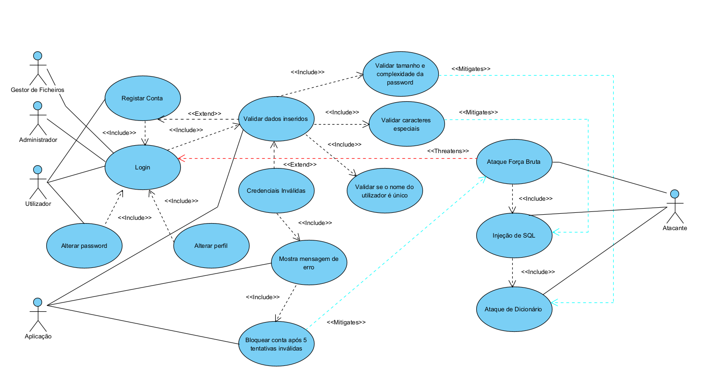

## User Order

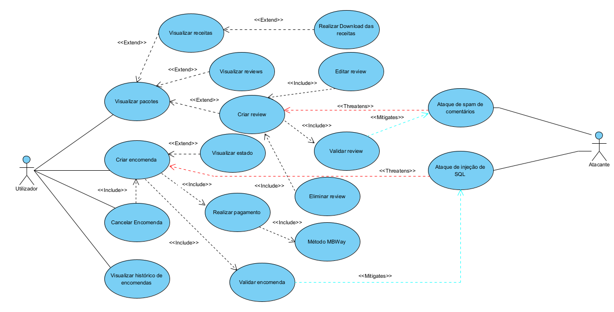

## File manager

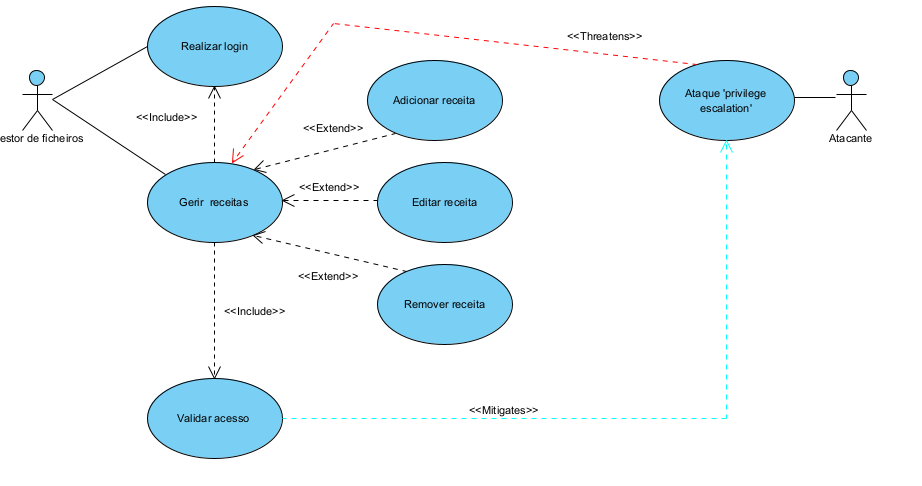

## Administrator

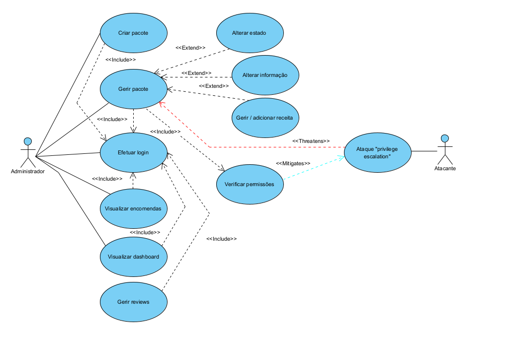

# Aquitetura

## Domain model

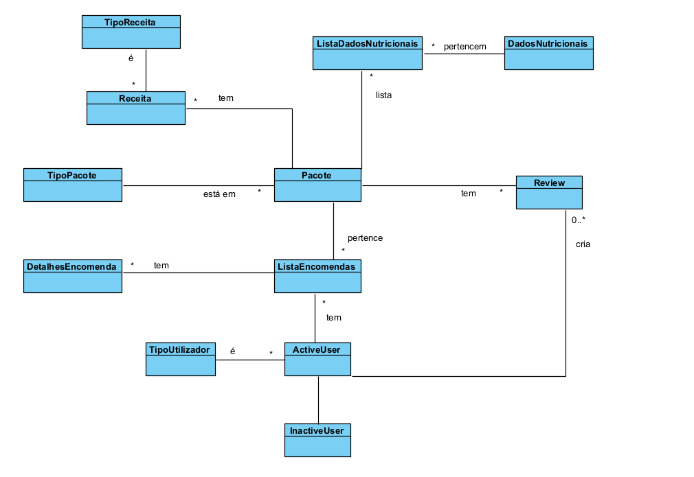

## Diagrama de entidade relação

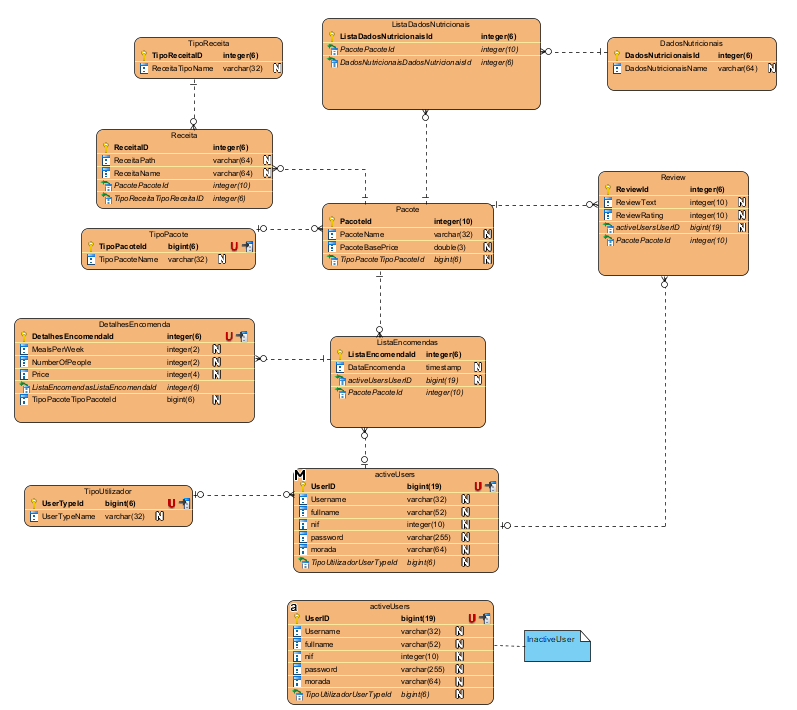

## Diagramas de implantanção

### Diagrama de implantação de nível 1

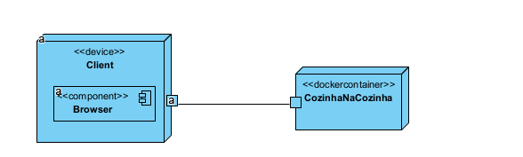

### Diagrama de implantação de nível 2

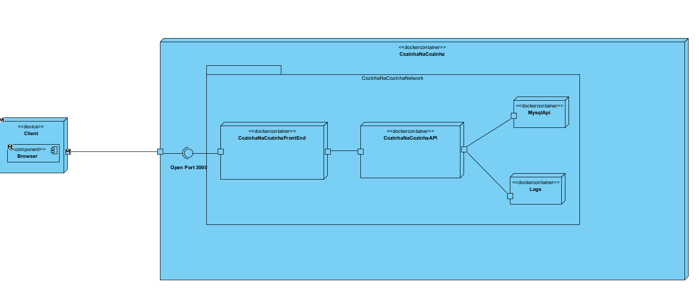

## Diagrama de componentes

### Diagrama de componentes de nível 2

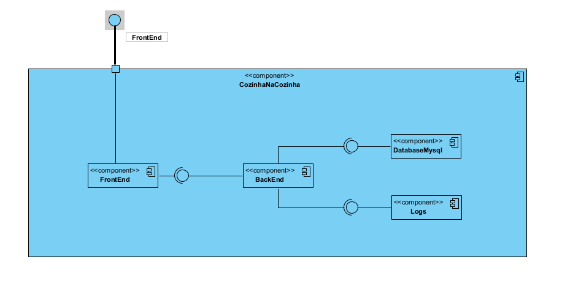

### Diagrama de componentes de nível 3

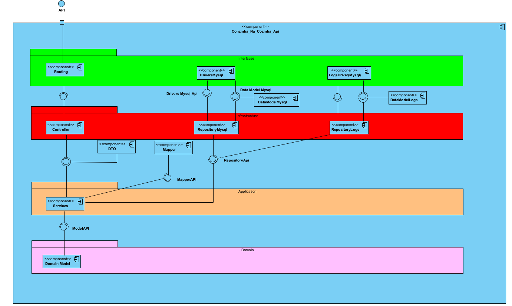

## Diagrama de pacotes

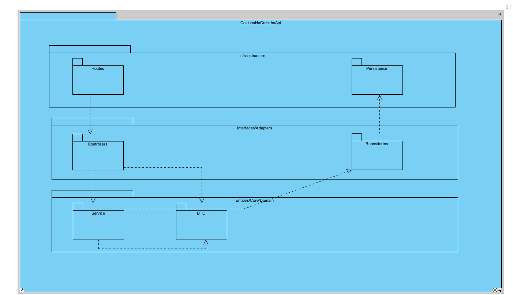

# Pipeline Design

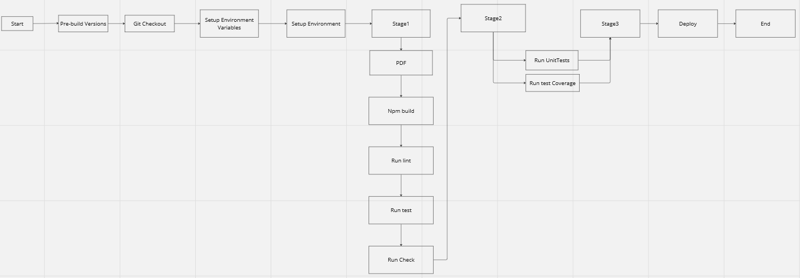

# 6 Threat Analysis

## 6.1 STRIDE

| Categoria              | Descrição                                                                                                                                                                                                                                                                                        |
|------------------------|--------------------------------------------------------------------------------------------------------------------------------------------------------------------------------------------------------------------------------------------------------------------------------------------------|
| Spoofing               | **Threat 1**: A aplicação tem de ser accessível aos utilizadores, consequentemente tem de ser fácil de usar, contudo não se pode introduzir uma ameaça<br/> **Threat 2**: Visto esta aplicação ser delivery service, implica que haja a possibilidade de alguem se fazer passar por outra pessoa |
| Tampering              | **Threat 1**: Como existem receitas para fazer download, que se encontram no servidor, é possivel que estas sejam editadas                                                                                                                                                                       |
| Repudiation            | Sem Ameaças                                                                                                                                                                                                                                                                                      |
| Information disclosure | **Threat 1**: É possivel que haja XSS visto haver formas de inserir scripts de javascript, com isto é possivel adquirir informação de outros utilizadores  <br/> **Threat 2**: É possivel interceptar pedidos de Http, consequentemente obter informação que não era suposto                     |
| Denial of service      | **Threat 1**: Visto ser um sistema monólitico, é possivel efetuar um DoS                                                                                                                                                                                                                         |
| Elevation of privilege | Sem Ameaças                                                                                                                                                                                                                                                                                      |

## 6.2 ASF

| Category                 | Description                                                                                                                                             |
|--------------------------|---------------------------------------------------------------------------------------------------------------------------------------------------------|
| Auditing and Logging     | **Threat 1**: Como não existe sistema de logging, não é possivel saber quem fez o quê e quando. <br/>**Threat 2**: Qualquer pessoa pode aceder aos logs |
| Authentication           | **Threat 1**: Com o sistema simples que está em uso, é relativamente fácil de usar credenciais de outros utilizadores                                   |
| Authorization            | **Threat 1**: Qualquer pessoa pode fazer download das receitas, criando um possivel ponto de entrada                                                    |
| Configuration management | **Threat 1**: A aplicação está a correr com todas as permições, logo é uma possível ameaça                                                              |

## 6.3 Entry Points

Os Entry points são os diferentes locais de acesso e interação dos utilizadores com o sistema da Cozinha na Cozinha.
Cada ponto de entrada oferece uma funcionalidade específica e define o nível de acesso necessário. Eles são essenciais
para a navegação e utilização adequada da plataforma, proporcionando uma experiência intuitiva e segura para os
utilizadores.

Abaixo está uma lista dos principais pontos de entrada do sistema, juntamente com uma breve descrição de suas
funcionalidades e os níveis de confiança associados:

| ID | Name                              | Description                                                                                                                          | Trust Level                                                                                                                                |
|----|-----------------------------------|--------------------------------------------------------------------------------------------------------------------------------------|--------------------------------------------------------------------------------------------------------------------------------------------|
| 1  | HTTPS Port                        | O site da CozinhaNaCozinha é acessível apenas através do uso de TLS. Todas as páginas do site estão protegidas por esta camada.      | (1) Anonymous Web User (2) Utilizador com credenciais de login válidas (3) Utilizador com credenciais de login inválidas (4) Administrador |
| 2  | Página de Login                   | Membros e administradores devem fazer login para aceder a funcionalidades de aquisição de serviço ou gestão dos serviços adquiridos. | (1) Anonymous Web User (2) Utilizador com credenciais de login válidas (3) Utilizador com credenciais de login inválidas (4) Administrador |
| 3  | Página Inicial                    | Todos os visitantes podem aceder à página principal para visualizar planos, serviços, informações e tirar dúvidas.                   | (1) Anonymous Web User (2) Utilizador com credenciais de login válidas (3) Utilizador com credenciais de login inválidas (4) Administrador |
| 4  | Página de Planos de Refeições     | Apresenta diferentes planos de refeições disponíveis para compra. Os utilizadores podem visualizar opções e selecionar as desejadas. | (1) Anonymous Web User (2) Utilizador com credenciais de login válidas (3) Utilizador com credenciais de login inválidas (4) Administrador |
| 5  | Página de Receitas                | Oferece uma coleção de receitas para inspirar utilizadores na preparação de refeições.                                               | (1) Anonymous Web User (2) Utilizador com credenciais de login válidas (3) Utilizador com credenciais de login inválidas (4) Administrador |
| 6  | Página de Subscrição              | Permite aos utilizadores gerir as suas subscrições, atualizando informações de pagamento e preferências de entrega.                  | (2) Utilizador com credenciais de login válidas (4) Administrador                                                                          |
| 7  | Página de Contacto                | Oferece informações de contacto para os utilizadores entrarem em contacto com o suporte ao cliente.                                  | (1) Anonymous Web User (2) Utilizador com credenciais de login válidas (4) Administrador                                                   |
| 8  | Página Sobre Nós                  | Fornece informações sobre a empresa, sua missão, valores e equipa.                                                                   | (1) Anonymous Web User (2) Utilizador com credenciais de login válidas (4) Administrador                                                   |
| 9  | Página de FAQ                     | Responde a perguntas frequentes sobre o serviço, procedimentos de entrega, políticas de cancelamento, etc.                           | (1) Anonymous Web User (2) Utilizador com credenciais de login válidas (4) Administrador                                                   |
| 10 | Painel de Administração           | Interface exclusiva para administradores gerirem utilizadores, conteúdo do site e relatórios de vendas.                              | (4) Administrador                                                                                                                          |
| 11 | Página de Perfil do Utilizador    | Permite aos utilizadores visualizar e editar as suas informações pessoais, histórico de pedidos e preferências de refeições.         | (2) Utilizador com credenciais de login válidas                                                                                            |
| 12 | Página do Carrinho                | Mostra os itens selecionados pelos utilizadores para compra antes do checkout.                                                       | (2) Utilizador com credenciais de login válidas                                                                                            |
| 13 | Página de Checkout                | Permite aos utilizadores rever e confirmar as suas compras antes do pagamento.                                                       | (2) Utilizador com credenciais de login válidas                                                                                            |
| 14 | Página de Histórico de Encomendas | Exibe o histórico de encomendas dos utilizadores, incluindo detalhes da compra e estado de entrega.                                  | (2) Utilizador com credenciais de login válidas                                                                                            |
| 15 | Página de upload às receitas      | Permite ao administrador dar upload às receitas e aos packs                                                                          | (4) Administrador                                                                                                                          |
| 16 | Página de download das receitas   | Permite aos utilizadores registrados fazerem download das receitas do pack da semana                                                 | (2) Utilizador com credenciais de login                                                                                                    |

## 6.4 Exit Points

| ID | Name                                 |
|----|--------------------------------------|
| 1  | HTTP Response                        |
| 2  | Pedidos à API                        |
| 3  | Falha na validação dos dados         |
| 4  | Operação de escrita na base de dados |
| 5  | Finalização de uma transação         |
| 6  | Tratar de Erros                      |
| 7  | Logging                              |
| 8  | Término da Sessão                    |
| 9  | Interação dos utilizadores           |

## 6.5 Qualitative Risk Model

Como forma de criar o "Qualitative Risk Model", determinou-se que a escala atribuída
para o "Likelihood" e o "Impact" varia entre 1 e 5, sendo que 1 seria o menor valor (menor impacto/probabilidade) e 5
seria o maior valor.

Para calcular o valor do risco, utilizou-se a fórmula: Risk = Likelihood * Impact ,definida em
https://owasp.org/www-community/OWASP_Risk_Rating_Methodology .

Desta forma, considerou-se os seguintes riscos:

**R1** - Denial of Service

**R2** - Information Disclosure

**R3** - Spoofing

**R4** - Tampering

**R5** - Repudiation

**R6** - Elevation of Privilege

**R7** - Social Engineering

| Risk | Likelihood | Impact | Risk Value |
|------|------------|--------|------------|
| R1   | 4          | 5      | 20         |
| R2   | 4          | 5      | 20         |
| R3   | 3          | 3      | 9          |
| R4   | 2          | 2      | 4          |
| R5   | 1          | 2      | 2          |
| R6   | 2          | 5      | 10         |
| R7   | 2          | 4      | 8          |

Analisando a seguinte tabela, os riscos RS1 e RS2 apresentam um maior valor,
sendo necessário prioritizar a mitigação dos mesmos, já os riscos RS4 e RS5, apresentam
um valor inferior, podendo exigir uma atenção menos imediata.

## 6.6 Countermeasures

### STRIDE

| Categoria              | Descrição                                                                                                                                                                                                                                                                                                                                                          |
|------------------------|--------------------------------------------------------------------------------------------------------------------------------------------------------------------------------------------------------------------------------------------------------------------------------------------------------------------------------------------------------------------|
| Spoofing               | **Countermeasure 1**: Utilização de autenticação de dois fatores<br/> **Countermeasure 2**: É obrigatório ter passwords fortes <br/> **Countermeasure 3**: É utilizado Jwt em vez de uma autênticação baseada na base de dados                                                                                                                                     |
| Tampering              | **Countermeasure 2**: Utilização de HTTPS para as comunicações entre o cliente e o servidor <br/> **Countermeasure 3**: Criar diferentes definições de acessos                                                                                                                                                               |
| Repudiation            | **Countermeasure 1**: Todas as compras são guardadas na base de dados em formato de event streaming                                                                                                                                                                                                                                                                |
| Information disclosure | **Countermeasure 1**: Utilização de HTTPS para as comunicações entre o cliente e o servidor<br/> **Countermeasure 2**: Utilização de JWT para autenticação<br/> **Countermeasure 3**: Utilização de CORS para proteger a API <br/> **Countermeasure 3**: Aplicar algoritmos de validação a inputs                                                                  |
| Denial of service      | **Countermeasure 1**: Utilização de um sistema distribuido em vez de um sistema monolitico<br/> **Countermeasure 2**: Utilização de um sistema de rate limiting                                                                                                                                                                                                    |
| Elevation of privilege | **Countermeasure 1**: Utilização de HTTPS para as comunicações entre o cliente e o servidor<br/> **Countermeasure 2**: Utilização de JWT para autenticação<br/> **Countermeasure 3**: Utilização de CORS para proteger a API <br/> **Countermeasure 3**: Aplicar algoritmos de validação a inputs <br/> **Countermeasure 4**: Ninguem deve ter a capacidade de mudar os privilégios do sistema |

## 6.7 Dataflow Diagram Lv1

O diagrama de fluxo de dados é uma representação visual que ilustra o percurso e processamento dos dados dentro do
sistema da CozinhaNaCozinha. Ele descreve como os dados são obtidos, manipulados e transformados ao longo de diferentes
processos e entidades do sistema. Este diagrama oferece uma visão abrangente do fluxo de informações, desde sua entrada
no sistema até sua saída, ajudando a entender o comportamento e a interação dos componentes do sistema.

Ao analisar o diagrama de fluxo de dados, é possível identificar os diferentes elementos do sistema, como entidades
externas, processos internos e armazenamento de dados. Cada seta representa o movimento de dados entre esses elementos,
mostrando a direção e o tipo de informação sendo transmitida. Além disso, os processos de transformação de dados são
representados por retângulos, enquanto os dados armazenados são mostrados em bases de dados ou repositórios.

O diagrama abaixo ilustra o diagrama de nível 1, que, por sua natureza mais abrangente, não apresenta detalhes
específicos. Como podemos observar no diagrama, os utilizadores interagem com a aplicação web, ou frontend, onde também
podem receber inputs de cookies, caso já existam. O percurso prossegue com a comunicação bidirecional com a API do
backend, o que significa que ambos os lados recebem e enviam informações um para o outro. No backend, dependendo da
operação, as informações podem ser recebidas da base de dados relacional ou do sistema de ficheiros, e todas essas
operações são registradas nos logs. É importante destacar que as comunicações entre o utilizador, a aplicação web e a
API do backend ocorrem via HTTPS, garantindo segurança na transmissão de dados.

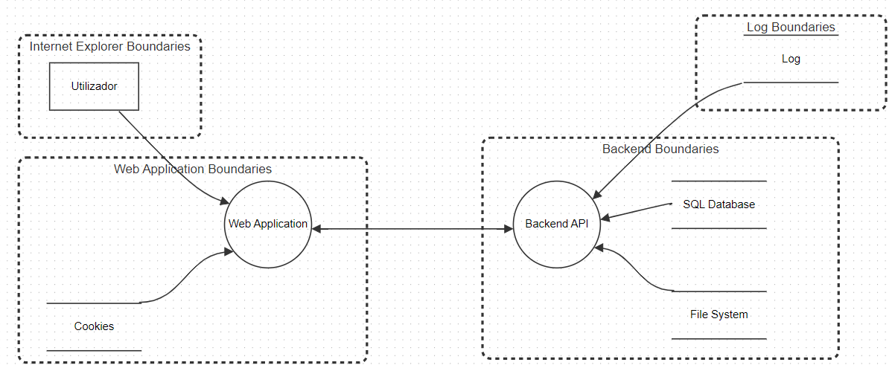

## 6.8 DREAD

O modelo DREAD é uma estrutura de avaliação de riscos comumente usada para identificar e priorizar vulnerabilidades em
sistemas de software. Cada letra no acrônimo DREAD representa um critério específico usado para avaliar o impacto das
vulnerabilidades. Vamos analisar brevemente cada um desses critérios:

D - Damage Potential (Potencial de Dano)
Este critério avalia o potencial de danos que uma vulnerabilidade pode causar se explorada por um atacante. Uma
pontuação alta indica que a vulnerabilidade pode resultar em danos significativos ao sistema ou aos dados.

R - Reproducibility (Reprodutibilidade)
A Reprodutibilidade considera a probabilidade de que a vulnerabilidade possa ser reproduzida em diferentes
circunstâncias. Uma pontuação alta sugere que a vulnerabilidade pode ser facilmente reproduzida e explorada
repetidamente.

E - Exploitability (Explorabilidade)
A Explorabilidade avalia o quão fácil é para um atacante explorar a vulnerabilidade. Uma pontuação alta indica que a
vulnerabilidade pode ser facilmente explorada, possivelmente através de métodos automatizados.

A - Affected Users (Utilizadores Afetados)
Este critério analisa o número e a importância dos utilizadores que podem ser afetados pela vulnerabilidade. Uma
pontuação alta indica que um grande número de utilizadores pode ser afetado, especialmente aqueles com informações
sensíveis ou privilegiadas.

D - Discoverability (Descoberta)
A Descoberta considera o quão fácil é para um atacante descobrir a vulnerabilidade. Uma pontuação alta sugere que a
vulnerabilidade pode ser facilmente descoberta, possivelmente através de métodos de teste de segurança automatizados.

Abaixo é possivel observar algumas das ameaças detetadas ao usar o software Microsft Thread Model Tool.

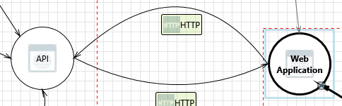

1. **Weak Authentication Scheme**
    - **D (Damage Potencial)**: Alto (a fraqueza na autenticação pode levar à divulgação não autorizada de informações
      confidenciais dos utilizadores).
    - **R (Reproducibility)**: A reprodução deste problema é provável, especialmente se as fraquezas na autenticação são
      comuns e podem ser exploradas repetidamente.
    - **E (Exploitability)**: A explorabilidade é alta, especialmente se as vulnerabilidades de autenticação são
      geralmente alvo de ataques automatizados e podem ser exploradas facilmente.
    - **A (Affected users)**: Todos os utilizadores do sistema podem ser afetados, especialmente aqueles cujas
      credenciais estão em risco.
    - **D (Discoverability)**: A descoberta deste problema é relativamente fácil, especialmente porque as fraquezas na
      autenticação são conhecidas e podem ser identificadas através de testes de segurança.

2. **Web Application Process Memory Tampered**
    - **D (Damage Potencial)**: Alto (a manipulação da memória do processo da aplicação web pode levar a
      vulnerabilidades de execução remota de código).
    - **R (Reproducibility)**: A reprodução deste problema é provável, especialmente se a aplicação web tiver acesso
      direto à memória ou aos ponteiros.
    - **E (Exploitability)**: A explorabilidade é alta, especialmente se a aplicação web permitir a execução de funções
      arbitrarias ou manipulação de ponteiros.
    - **A (Affected users)**: Todos os utilizadores da aplicação web podem ser afetados, pois a manipulação da memória
      pode comprometer a segurança do sistema.
    - **D (Discoverability)**: A descoberta deste problema pode ser mais difícil, mas ainda é possível identificar
      através de testes de segurança e análise de código.

3. **Elevation Using Impersonation**
    - **D (Damage Potencial)**: Alto (a elevação de privilégios pode permitir que um atacante execute ações maliciosas
      em nome do aplicativo web).
    - **R (Reproducibility)**: A reprodução deste problema é provável, especialmente se o API permitir a falsificação de
      contexto.
    - **E (Exploitability)**: A explorabilidade é alta, especialmente se o API permitir a falsificação de contexto.
    - **A (Affected users)**: Todos os utilizadores do sistema podem ser afetados, especialmente se as ações realizadas
      com privilégios elevados comprometerem a segurança do sistema.
    - **D (Discoverability)**: A descoberta deste problema pode ser difícil, mas ainda é possível identificar através de
      testes de segurança e monitoramento de atividades suspeitas.

4. **JavaScript Object Notation Processing**
    - **D (Damage Potencial)**: Alto (a manipulação do JSON pode levar à execução de scripts maliciosos ou à divulgação
      não autorizada de informações sensíveis).
    - **R (Reproducibility)**: A reprodução deste problema é provável, especialmente se a aplicação web processar JSON
      de forma insegura.
    - **E (Exploitability)**: A explorabilidade é alta, especialmente se a aplicação web permitir a execução de scripts
      maliciosos ou se os dados JSON não forem devidamente validados.
    - **A (Affected users)**: Todos os utilizadores da aplicação web que interagem com dados JSON podem ser afetados.
    - **D (Discoverability)**: A descoberta deste problema pode ser relativamente fácil, especialmente através de testes
      de segurança automatizados.

5. **Elevation by Changing the Execution Flow in Web Service**
    - **D (Damage Potencial)**: Alto (a alteração do fluxo de execução pode permitir que um atacante execute ações
      maliciosas ou comprometa a integridade do sistema).
    - **R (Reproducibility)**: A reprodução deste problema é provável, especialmente se o API permitir a alteração do
      fluxo de execução através de dados não validados.
    - **E (Exploitability)**: A explorabilidade é alta, especialmente se o API permitir a alteração do fluxo de execução
      através de dados não validados.
    - **A (Affected users)**: Todos os utilizadores do sistema podem ser afetados, especialmente se as ações realizadas
      com o fluxo de execução alterado comprometerem a segurança do sistema.
    - **D (Discoverability)**: A descoberta deste problema pode ser mais difícil, mas ainda é possível identificar
      através de testes de segurança e monitoramento de atividades suspeitas.

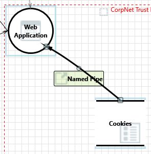

1. **Spoofing of Source Data Store Cookies**
    - **D (Damage Potencial)**: Alto (cookies podem ser falsificados por um atacante e isso pode levar à entrega de
      dados incorretos para a Aplicação Web).
    - **R (Reproducibility)**: A reprodução deste problema é provável, especialmente se cookies não forem devidamente
      protegidos.
    - **E (Exploitability)**: A explorabilidade é alta, pois a falsificação de cookies é uma técnica bem conhecida e
      pode ser facilmente explorada.
    - **A (Affected users)**: Todos os utilizadores que interagem com a aplicação web podem ser afetados, especialmente
      se dados incorretos forem entregues devido à falsificação de cookies.
    - **D (Discoverability)**: A descoberta deste problema é relativamente fácil, especialmente se os cookies não forem
      adequadamente protegidos contra falsificação.

2. **Cross Site Scripting**
    - **D (Damage Potencial)**: Alto (o servidor web 'Aplicação Web' pode ser alvo de um ataque de cross-site scripting
      porque não sanitiza entrada não confiável).
    - **R (Reproducibility)**: A reprodução deste problema é provável, especialmente se a entrada não confiável não for
      adequadamente tratada.
    - **E (Exploitability)**: A explorabilidade é alta, pois o cross-site scripting é uma vulnerabilidade comum e pode
      ser facilmente explorada.
    - **A (Affected users)**: Todos os utilizadores que interagem com a aplicação web podem ser afetados, especialmente
      se forem vítimas de ataques de cross-site scripting.
    - **D (Discoverability)**: A descoberta deste problema é relativamente fácil, especialmente se a aplicação web não
      tiver proteções adequadas contra cross-site scripting.

3. **Persistent Cross Site Scripting**
    - **D (Damage Potencial)**: Alto (o servidor web 'Aplicação Web' pode ser alvo de um ataque de cross-site scripting
      persistente porque não sanitiza corretamente as entradas e saídas de cookies).
    - **R (Reproducibility)**: A reprodução deste problema é provável, especialmente se a entrada e saída de cookies não
      forem adequadamente tratadas.
    - **E (Exploitability)**: A explorabilidade é alta, pois o cross-site scripting persistente pode ser explorado
      repetidamente.
    - **A (Affected users)**: Todos os utilizadores que interagem com a aplicação web podem ser afetados, especialmente
      se forem vítimas de ataques de cross-site scripting persistente.
    - **D (Discoverability)**: A descoberta deste problema é relativamente fácil, especialmente se a aplicação web não
      tiver proteções adequadas contra cross-site scripting persistente.

4. **Weak Access Control for a Resource**
    - **D (Damage Potencial)**: Alto (a proteção inadequada de cookies pode permitir que um atacante leia informações
      não destinadas à divulgação).
    - **R (Reproducibility)**: A reprodução deste problema é provável, especialmente se a proteção de cookies não for
      adequadamente implementada.
    - **E (Exploitability)**: A explorabilidade é alta, pois a leitura de informações não autorizadas é uma técnica
      comum de ataque.
    - **A (Affected users)**: Todos os utilizadores que interagem com a aplicação web podem ser afetados, especialmente
      se informações sensíveis forem acessadas indevidamente.
    - **D (Discoverability)**: A descoberta deste problema é relativamente fácil, especialmente se a aplicação web não
      tiver controles de acesso adequados.

5. **Authenticated Data Flow Compromised**
    - **D (Damage Potencial)**: Alto (um atacante pode ler ou modificar dados transmitidos sobre um fluxo de dados
      autenticado).
    - **R (Reproducibility)**: A reprodução deste problema é provável, especialmente se o fluxo de dados autenticado não
      for adequadamente protegido.
    - **E (Exploitability)**: A explorabilidade é alta, pois a leitura ou modificação de dados em um fluxo de dados
      autenticado é uma vulnerabilidade séria.
    - **A (Affected users)**: Todos os utilizadores que dependem do fluxo de dados autenticado podem ser afetados,
      especialmente se as informações forem comprometidas.
    - **D (Discoverability)**: A descoberta deste problema pode ser difícil, pois pode exigir análise detalhada do
      sistema e monitoramento de atividades suspeitas.

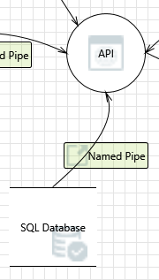

1. **Spoofing of Source Data Store SQL Database**
    - **D (Damage Potencial)**: Alto (a base de dados SQL pode ser falsificado por um atacante e isso pode levar à
      entrega de dados incorretos para a API).
    - **R (Reproducibility)**: A reprodução deste problema é provável, especialmente se a base de dados SQL não for
      adequadamente protegido contra spoofing.
    - **E (Exploitability)**: A explorabilidade é alta, pois o spoofing da base de dados SQL é uma técnica bem conhecida
      e pode ser facilmente explorada.
    - **A (Affected users)**: Todos os utilizadores que interagem com a API podem ser afetados, especialmente se dados
      incorretos forem entregues devido ao spoofing da base de dados SQL.
    - **D (Discoverability)**: A descoberta deste problema é relativamente fácil, especialmente se a base de dados SQL
      não for adequadamente protegido contra spoofing.

2. **Weak Access Control for a Resource**
    - **D (Damage Potencial)**: Alto (a proteção inadequada da base de dados SQL pode permitir que um atacante leia
      informações não destinadas à divulgação).
    - **R (Reproducibility)**: A reprodução deste problema é provável, especialmente se a proteção da base de dados SQL
      não for adequadamente implementada.
    - **E (Exploitability)**: A explorabilidade é alta, pois a leitura de informações não autorizadas é uma técnica
      comum de ataque.
    - **A (Affected users)**: Todos os utilizadores que interagem com a API podem ser afetados, especialmente se
      informações sensíveis forem acessadas indevidamente.
    - **D (Discoverability)**: A descoberta deste problema é relativamente fácil, especialmente se a API não tiver
      controles de acesso adequados.

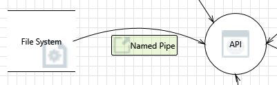

1. **Spoofing of Source Data Store File System**
    - **D (Damage Potencial)**: Alto (o sistema de ficheiros pode ser falsificado por um atacante e isso pode levar à
      entrega de dados incorretos para a API).
    - **R (Reproducibility)**: A reprodução deste problema é provável, especialmente se o sistema de ficheiros não for
      adequadamente protegido contra spoofing.
    - **E (Exploitability)**: A explorabilidade é alta, pois o spoofing do sistema de ficheiros é uma técnica bem
      conhecida e pode ser facilmente explorada.
    - **A (Affected users)**: Todos os utilizadores que interagem com a API podem ser afetados, especialmente se dados
      incorretos forem entregues devido ao spoofing do sistema de ficheiros.
    - **D (Discoverability)**: A descoberta deste problema é relativamente fácil, especialmente se o sistema de
      ficheiros não for adequadamente protegido contra spoofing.

2. **Weak Access Control for a Resource**
    - **D (Damage Potencial)**: Alto (a proteção inadequada do sistema de ficheiros pode permitir que um atacante leia
      informações não destinadas à divulgação).
    - **R (Reproducibility)**: A reprodução deste problema é provável, especialmente se a proteção do sistema de
      ficheiros não for adequadamente implementada.
    - **E (Exploitability)**: A explorabilidade é alta, pois a leitura de informações não autorizadas é uma técnica
      comum de ataque.
    - **A (Affected users)**: Todos os utilizadores que interagem com a API podem ser afetados, especialmente se
      informações sensíveis forem acessadas indevidamente.
    - **D (Discoverability)**: A descoberta deste problema é relativamente fácil, especialmente se a API não tiver
      controles de acesso adequados.

3. **Authenticated Data Flow Compromised**
    - **D (Damage Potencial)**: Alto (um atacante pode ler ou modificar dados transmitidos sobre um fluxo de dados
      autenticado).
    - **R (Reproducibility)**: A reprodução deste problema é provável, especialmente se o fluxo de dados autenticado não
      for adequadamente protegido.
    - **E (Exploitability)**: A explorabilidade é alta, pois a leitura ou modificação de dados em um fluxo de dados
      autenticado é uma vulnerabilidade séria.
    - **A (Affected users)**: Todos os utilizadores que dependem do fluxo de dados autenticado podem ser afetados,
      especialmente se as informações forem comprometidas.
    - **D (Discoverability)**: A descoberta deste problema pode ser difícil, pois pode exigir análise detalhada do
      sistema e monitoramento de atividades suspeitas.

## 6.9 Attack Tree

A attack tree é uma representação de possíveis vias de ataque que um utilizador malicioso pode usar para comprometer um
sistema. Cada nó na árvore representa um ponto de decisão para o atacante, e os ramos indicam diferentes caminhos que
podem ser seguidos para alcançar um objetivo malicioso. Vamos explorar brevemente alguns dos ataques representados nesta
árvore:

### Ataque 1: Fraca Autenticação

- **Sub-ataque 1.1**: Brute Force Attack
- **Sub-ataque 1.2**: Password Guessing
- **Sub-ataque 1.3**: Roubo de Credenciais

### Ataque 2: Vulnerabilidades na Validação do Input

- **Sub-ataque 2.1**: Injeção de SQL
- **Sub-ataque 2.2**: Cross site scripting (XSS)
- **Sub-ataque 2.3**: Injeção de Comandos

### Ataque 3: Exploração de Configurações Incorretas do Servidor

- **Sub-ataque 3.1**: Credenciais Padrão
- **Sub-ataque 3.2**: Exposição de Informações Sensíveis
- **Sub-ataque 3.3**: Falta de Permissões dos Ficheiros

### Ataque 4: Vulnerabilidades nos Componentes de Terceiros

- **Sub-ataque 4.1**: Exploração de vulnerabilidades em bibliotecas de terceiros
- **Sub-ataque 4.2**: Utilização de software desatualizado
- **Sub-ataque 4.3**: Falta de Permissões dos Ficheiros

### Ataque 5: Intercetação de Dados

- **Sub-ataque 5.1**: Interceção de Comunicações não Seguras (HTTP)
- **Sub-ataque 5.2**: Interceção de Comunicações Criptografadas (SSL/TLS)

### Ataque 6: Denial of Service (DoS/DDoS)

- **Sub-ataque 6.1**: Sobrecarga de Recursos
- **Sub-ataque 6.2**: Ataques de Amplificação
- **Sub-ataque 6.3**: Ataques de Bandwitch Exhaustion

### Ataque 7: Ataques de Sessão

- **Sub-ataque 7.1**: Captura de Sessão
- **Sub-ataque 7.2**: Fixação de Sessão
- **Sub-ataque 7.3**: Sequestro de Sessão
- **Sub-ataque 7.4**: Redirecionamento Aberto

### Ataque 8: Vulnerabilidades no Upload de ficheiros

- **Sub-ataque 8.1**: Execução de ficheiros Maliciosos
- **Sub-ataque 8.2**: Upload de ficheiros com Nomes Manipulados
- **Sub-ataque 8.3**: Bypass de Restrições de Tipo de Arquivo

### Ataque 9: Vulnerabilidades no Download de ficheiros

- **Sub-ataque 9.1**: Download de ficheiros Sensíveis
- **Sub-ataque 9.2**: Inclusão de ficheiros Executáveis
- **Sub-ataque 9.3**: Download de ficheiros com Nomes Manipulados

### Ataque 10: Fraudes em Pagamentos Bancários

- **Sub-ataque 10.1**: Phishing de Dados de Cartão de Crédito
- **Sub-ataque 10.2**: Man-in-the-Middle (MitM) em Transações
- **Sub-ataque 10.3**: Roubo de Credenciais de Conta Bancária

# 1º Sprint

Para este primerio sprint foi então pedido que fosse automatizado o processo de building e deployment através de uma
pipeline, assim como a criação de testes de segurança que deviam ter sido planeados na parte de pleaneamento.

## 7 Pipeline

Para a pipeline tentamos seguir a estrutura planeada, contudo a mesma sofreu algumas alterações, especialmente ao nivel
do deployment. Usamos as github actions, visto ser uma ferramenta relativamente simples e com uma quantidade gigantesca
de actions disponiveis, ao qual permite diminiur a complexidade da pipeline.

Temos dois workflows, um para dar build e testar a aplicação na sua totalidade, o segundo workflow é essencialmente para
efetuar uma release da aplicação.

Sempre que um push ou um pull request é efetuado temos algumas ferramentas que vão fazer testes e análises ao código e
às dependências que a branch contém.

### 7.1 deployment.yml

Este é o workflow responsável pelo deployment da aplicação, é composto por 4 jobs.

1º job - build front end
2º job - build back end
3º job - push to docker hub
4º job - docker scout api
5º job - docker scout web

#### 7.1.1 Build Front end

Este é o primeiro job, que vai fazer o checkout do código, ou seja, vai para a branch que foi feito o push, vai dar
setup ao node, que será a versão stable (node 20), vai instalar as dependências presentes no package.json, a seguir dá
build. Até agora todas as tasks que foram executadas são essêncialmente para dar setup ao environment para a parte do
front end, após dar este setup começamos a parte importante, que é verificar se o nosso código está pronto para
produção, para isso chamamos o comando format, para formatar o código, depois chamamos o comando de lint para verificar
para erros dentro do código, variaveis ou dependências não utilizadas, chamamos o comando de tests para testar
o código e por fim chamamos o comando próprio ao sveltekit para validar o código que é o check.

```YAML
  buildFrontEnd:
    runs-on: ubuntu-latest

    steps:
      - name: Checkout Code
        uses: actions/checkout@v4

      - name: Set up node.js 20.11
        uses: actions/setup-node@v4
        with:
          node-version: 20

      - name: Install Dependencies
        run: npm install
        working-directory: ./desofs_svelte_front_end

      - name: Run build
        run: npm run build
        working-directory: ./desofs_svelte_front_end

      - name: Run format
        run: npm run format
        working-directory: ./desofs_svelte_front_end

      - name: Run linter
        run: npm run lint
        working-directory: ./desofs_svelte_front_end

      - name: Install conffeti
        run: npx playwright install --with-deps
        working-directory: ./desofs_svelte_front_end

      - name: Run unit tests
        run: npm run test:unit
        working-directory: ./desofs_svelte_front_end

      - name: Run Integration tests
        run: npx playwright test
        working-directory: ./desofs_svelte_front_end

      - name: Run Check
        run: npm run check
        working-directory: ./desofs_svelte_front_end
```

#### 7.1.2 Build Back end

Este é o nosso segundo job, inicialmente iniciamos um serviço, serviço esse que é nada mais nada menos que a nossa base
de dados, uma das novas features do github actions é que permite ativar diferentes serviços nomeadamente o mysql num
docker container, para isso basta adicionar o seguinte código:

```YAML
services:
  mysql:
    image: mysql:latest
    env:
      MYSQL_ROOT_PASSWORD: ${{ secrets.MYSQL_ROOT_PASSWORD }}
      MYSQL_DATABASE: ${{ secrets.DESOFS_DB_DEV_DB_NAME }}
      MYSQL_USER: ${{ secrets.DESOFS_DB_USER }}
      MYSQL_PASSWORD: ${{ secrets.DESOFS_DB_PASS }}
    ports:
      - 3306:3306
    options: --health-cmd="mysqladmin ping" --health-interval=10s --health-timeout=5s --health-retries=3
```

No código em yaml, inicamos então o serviço mysql, que contém secrets que foram guardados nos secrets do github. Além
disso, é feito uma verificação da health da base de dados para que apenas avance quando estiver totalmente ligada e
funcional. Apesar de ter sido feito isso, nada garante que a base de dados esteja a aceitar conexões, e isso foi um
problema fácilmente resolvido. Através do código a seguir:

```YAML
      - name: Echo .env
        run: cat .env
        working-directory: ./desofsApi


      - name: Wait for 20 seconds
        run: sleep 10

      - name: Check Database Health
        run: nc -zvw 1 cozinha_na_cozinha_mysql 3306
        continue-on-error: true
```

O echo serve apenas para testar a capacidade do github actions ocultar os secrets, o sleep é para adicionar um tempo de
espera extra na pipeline para resolver o problema descrito anteriormente.

Após ter a base de dados a funcionar e a receber conexões, é feito o setup do java, a versão do java utilizada é o 17,
visto ser uma versão estável e com algumas funcionalidades interessantes. Após o setup do java, é feito a limpesa de
qualquer existencia de uma pasta "target" através do clean, após isto, são executados os testes, por fim executamos o
package para criar um jar e guardamos o jar como um artefacto. Também é executado o dependency check

```YAML
  buildBackEnd:
    runs-on: ubuntu-latest
    services:
      mysql:
        image: mysql:latest
        env:
          MYSQL_ROOT_PASSWORD: ${{ secrets.MYSQL_ROOT_PASSWORD }}
          MYSQL_DATABASE: ${{ secrets.DESOFS_DB_DEV_DB_NAME }}
          MYSQL_USER: ${{ secrets.DESOFS_DB_USER }}
          MYSQL_PASSWORD: ${{ secrets.DESOFS_DB_PASS }}
        ports:
          - 3306:3306
        options: --health-cmd="mysqladmin ping" --health-interval=10s --health-timeout=5s --health-retries=3
    steps:
      - name: Checkout Code
        uses: actions/checkout@v4

      - name: Create .env
        run: |

          touch .env
          echo "MYSQL_ROOT_PASSWORD=rootpwd" >> .env
          echo "DESOFS_DB_DEV_DB_NAME=data_desofs" >> .env
          echo "DESOFS_DB_USER=cozinha" >> .env
          echo "DESOFS_DB_PASS=123456789" >> .env
          echo "DESOFS_DB_HOST=desofs_mysql_db" >> .env
          echo "DESOFS_APP_SECRET=defaultappsecret" >> .env
        working-directory: ./desofsApi

      - name: Echo .env
        run: cat .env
        working-directory: ./desofsApi


      - name: Wait for 20 seconds
        run: sleep 10

      - name: Check Database Health
        run: nc -zvw 1 cozinha_na_cozinha_mysql 3306
        continue-on-error: true
      # Setup java version
      - name: Set up Java 17
        uses: actions/setup-java@v4
        with:
          distribution: 'temurin'
          java-version: '17'
          cache: 'maven'
          cache-dependency-path: 'desofsApi/pom.xml'

      - name: Maven Clean
        run: mvn clean
        working-directory: ./desofsApi

      - name: Maven Test
        run: mvn test
        working-directory: ./desofsApi

      - name: Maven Package
        run: mvn package
        working-directory: ./desofsApi

      - name: Upload Jar
        uses: actions/upload-artifact@v4
        with:
          name: desofsApi
          path: ./desofsApi/target/desofsApi-0.0.1-SNAPSHOT.jar


      - name: Depcheck
        uses: dependency-check/Dependency-Check_Action@main
        env:
          # actions/setup-java@v1 changes JAVA_HOME so it needs to be reset to match the depcheck image
          JAVA_HOME: /opt/jdk
        id: Depcheck
        with:
          project: 'test'
          path: '.'
          format: 'HTML'
          out: 'reports'
          args: >
            --enableRetired
      - name: Upload Test results
        uses: actions/upload-artifact@master
        with:
          name: Depcheck report
          path: ${{github.workspace}}/reports
```

#### 7.1.3 Push to Docker Hub

Este job, é apenas executado depois se ambos os jobs anteriores forem bem sucedidos, ou seja, se o front end e o back
end estiverem prontos para produção, é feito o push para o docker hub, para isso é feito o steup do environment,
executar o build do front end e o package do back end, faz se o login no docker hub com credenciais guardadas nos
secrets, depois dámos push tanto do front end como do back end para as suas docker registries.

```YAML
push-to-dockerhub:
  runs-on: ubuntu-latest

  steps:

    - name: Checkout Code
      uses: actions/checkout@v4

    - name: Set up node.js 20.11
      uses: actions/setup-node@v4
      with:
        node-version: 20

    - name: Install Dependencies
      run: npm install
      working-directory: ./desofs_svelte_front_end

    - name: Run build
      run: npm run build
      working-directory: ./desofs_svelte_front_end

    - name: Set up Java 17
      uses: actions/setup-java@v4
      with:
        distribution: 'temurin'
        java-version: '17'
        cache: 'maven'
        cache-dependency-path: 'desofsApi/pom.xml'

    - name: Maven Package
      run: mvn package -DskipTests
      working-directory: ./desofsApi

    - name: Login to Docker Hub
      uses: docker/login-action@v3
      with:
        username: ${{ secrets.DOCKER_USERNAME }}
        password: ${{ secrets.DOCKER_TOKEN }}

    - name: Build docker compose file
      run: docker-compose build


    - name: Print docker images
      run: docker images

    # tag the frontend image
    - name: Tag Frontend image
      run: docker tag desofs2024_m1b_2_desof-web:latest ${{ secrets.DOCKER_USERNAME }}/desofs2024_m1b_2-desof-web:latest

    - name: Tag Backend image
      run: docker tag desofs2024_m1b_2_desof-api:latest ${{ secrets.DOCKER_USERNAME }}/desofs2024_m1b_2-desof-api:latest

    - name: Build and push frontend
      run: docker push ${{ secrets.DOCKER_USERNAME }}/desofs2024_m1b_2-desof-web:latest

    - name: Build and push backend
      run: docker push ${{ secrets.DOCKER_USERNAME }}/desofs2024_m1b_2-desof-api:latest

  needs: [ buildFrontEnd, buildBackEnd ]
```

As imagens vão ser postas como latest visto que estão com a última versão possivel do código.

#### 7.1.4 Docker Scout

Este job é executado no final depois do push para o docker hub ser bem-sucedido, é feito então, uma analise dos
containers, nós queriamos por os ultimos jobs juntos, contudo, isso não é possivel pois o github fica numa dependencia
rotativa por causa do githubtoken, contudo, vamos considerar que são parte da mesma job. Neste caso, isto vai fazer o
login no docker hub e depois vai buscar as imagens para de seguida criar um report com as vulnerabilidades encontradas
pelo docker scout, este report vai ser posto na própria pull request para imediato feedback. Claro que existem
diferentes formas de geração que podem ser configuradas na github action através do parametro "command":

```YAML
  docker-scout-web:
    runs-on: ubuntu-latest

    steps:
      - name: Login to Docker Hub
        uses: docker/login-action@v3
        with:
          username: ${{ secrets.DOCKER_USERNAME }}
          password: ${{ secrets.DOCKER_TOKEN }}

      - name: Docker Scout
        id: docker-scout
        uses: docker/scout-action@v1
        with:
          command: cves,recommendations,quickview
          image: ${{ secrets.DOCKER_USERNAME }}/desofs2024_m1b_2-desof-web:latest
          to-latest: true
          ignore-unchanged: true
          write-comment: true
          only-fixed: true
          github-token: ${{ secrets.GITHUB_TOKEN }}
    needs:
      - push-to-dockerhub
```

### 7.2 release-please.yaml

Este workflow é responsável por criar uma release da aplicação, é composto por apenas 1 job, mas temos a intenção de
melhorar e adicionar a outro, no qual irá fazer um novo push para o docker hub mas com a tag da release.

```YAML
on:
  push:
    branches:
      - main

permissions:
  contents: write
  pull-requests: write

name: release-please

jobs:
  release-please:
    runs-on: ubuntu-latest
    steps:
      - uses: google-github-actions/release-please-action@v4
        with:
          # You will want to configure a GitHub Actions secret with a
          # Personal Access Token if you want GitHub Actions CI
          # checks to run on Release Please PRs.
          # The folowing assumes that you have created a personal access token
          # (PAT) and configured it as a GitHub action secret named
          # `MY_RELEASE_PLEASE_TOKEN` (this secret name is not important).
          #token: ${{ secrets.MY_RELEASE_PLEASE_TOKEN }}

          # if you dont need to trigger new workflow runs on a release please PR
          # its fine to use GITHUB_TOKEN as folows
          token: ${{ secrets.GITHUB_TOKEN }}

          # this is a built-in strategy in release-please, see "Action Inputs"
          # for more options
          release-type: simple
```

## 7.2 Ferramentas de análise de código

Para o auxílio da pipeline e para garantir a qualidade do código, foram utilizadas ferramentas de análise com
diferentes objetivos. Contudo, também usamos uma ferramenta externa para análise de código dinâmico, nomeadamente o
OWASP ZAP.

### SAST - Static Application Security Testing

Usamos duas ferramentas interessantes para análise estática de código, nomeadamente o SonarCloud ( que serve o mesmo
propósito que o sonarQube) e usamos também o codeQl que é uma ferramenta que já faz parte do github, apenas precisa de
ser ativada e o projeto no github tem de estar publico.

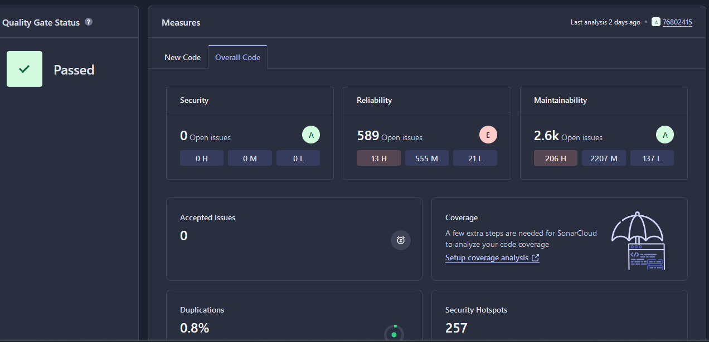

Esse é o sumário do projeto, isto demonstra as informações em comparação com o commit anterior, por isso pode parecer
que não tem nada. Apesar disso, temos outra parte do sonar cloud que mostar diferentes análises feitas em tempo real do
código:

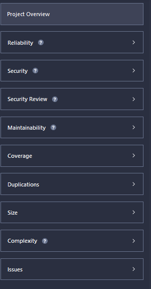

Mas o grande motivo de termos usado esta ferramenta foi essencialmente para podermos integrar com os "checks" do github
quando se faz pull request, assim o utilizador pode ver uma análise estática do código e ter o seu código impedido de
ser
merged caso tenha problemas críticos que possam ser resolvidos.

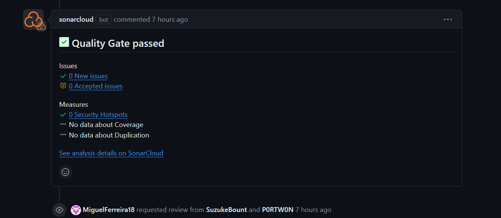

Aqui podemos ver a imagem do sonar cloud a comentar no pull request com o summario do código e se passou, ou não. Caso
não fosse aprovado pelo sonar cloud, não seria possível dar merge ao código.

O codeQl serve o quase para o mesmo propósito que o sonar cloud, contudo, é uma ferramenta que consta já com o github.

Um exemplo do codeQl em ação:

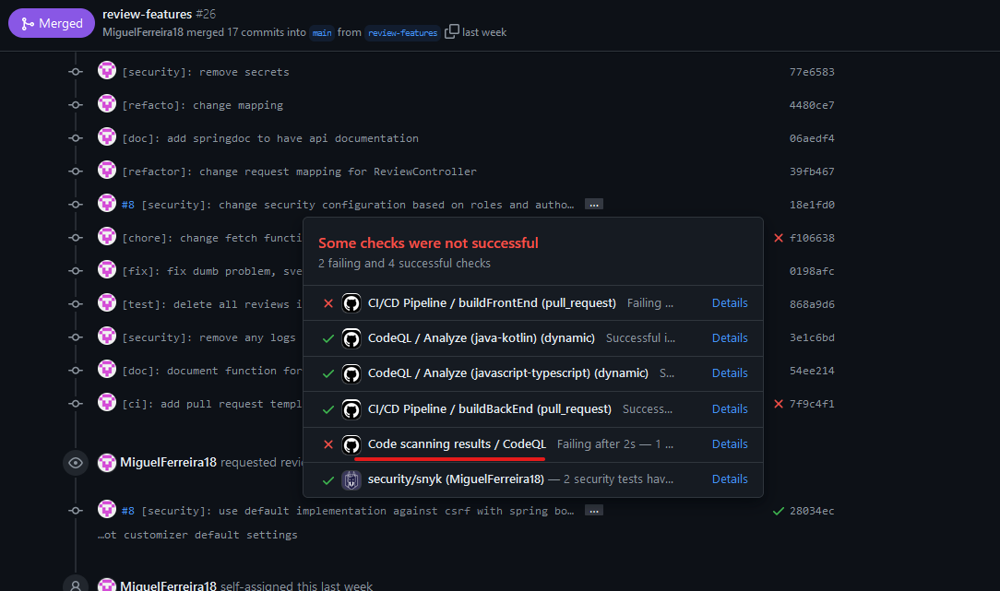

Isto foi uma vulnerabilidade que o codeQL encontrou no código. Ao carregarmos, podemos ver mais detalhadamente onde se
encontra o problema e a vulnerabilidade em si.

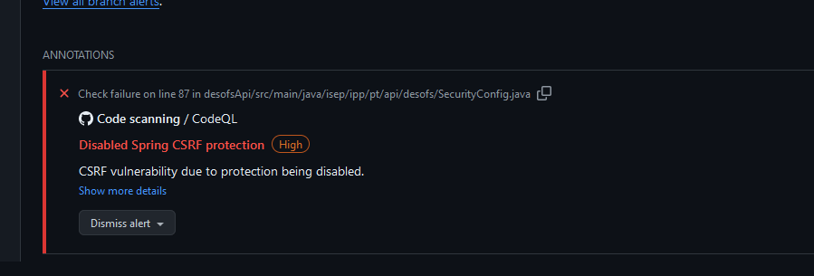

### DAST - Dynamic Application Security Testing

Para a análise dinâmica de código, usamos o OWASP ZAP, que é uma ferramenta de código aberto que pode ser usada para
encontrar vulnerabilidades de segurança em aplicações web.
A execução do OWASP ZAP não foi feita dentro da pipeline, embora seja possível, contudo não havia forma de impedir que
código com vulnerabilidades detetadas pelo ZAP fossem impedidas de levar merge. Assim, a execução do ZAP foi feita
manualmente, tivemos de criar um script (Zest script) no qual lhe é dado um bearer token (para poder efetuar requests na
api). Também foi necessário dar ao OWASP ZAP os endpoints da Api, isso foi feito através do springdoc, no qual
disponibiliza
end points para o swagger-ui e para o api-docs.

O report pode ser encontrado na pasta Sprint1/OWASP_ZAP_report e como podemos ver, temos apenas 1 vulnerabilidade grave.

### SCA - Software Composition Analysis

Para ferramentas de SCA foram usadas 4 ferramentas, três delas vão fazer uma análise durante a execução da pipeline, e a
outra é uma ferramenta que vai estar sempre atenta a vulnerabildidades nas depêndencias usadas.

A primeira ferramenta é o dependabot, que é uma ferramenta que faz parte do github, e que vai estar sempre atenta a
vulnerabilidades nas dependências usadas, e vai fazer pull requests para atualizar as dependências.

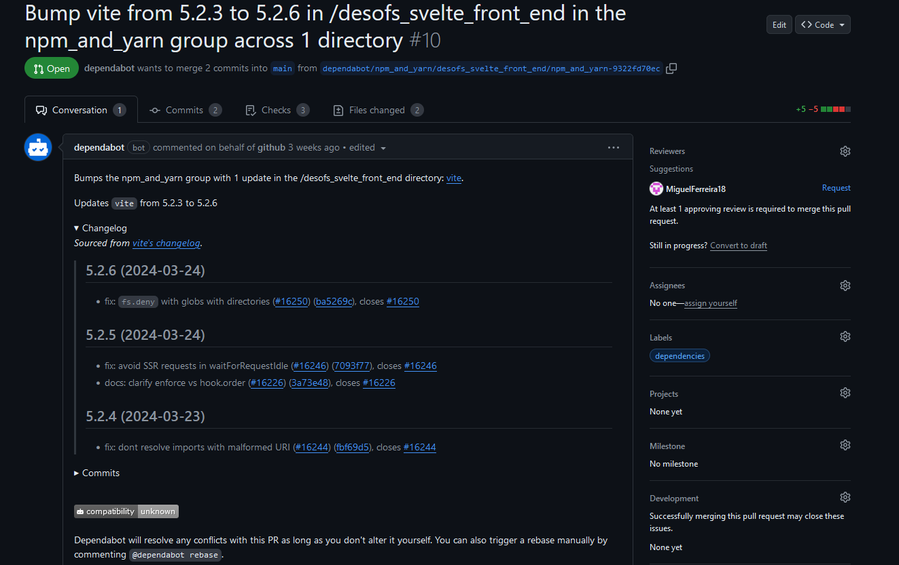

Como podemos ver pela imagem, o dependabot detetou uma atualização, contudo também é capaz de detetar vulnerabilidades
associadas a essa dependência.

A segunda ferramenta é o OWASP dependency check que vai ser executado na pipeline com o uso de uma github action, e
depois o report gerado vai ser guardado como um artefacto no sumário da pipeline. Existe um exemplo do report gerado na
pasta Sprint1/dependencyCheck.

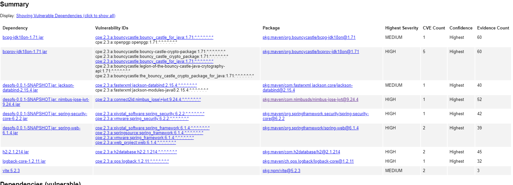

Pela seguinte imagem, podemos ver que temos algumas dependências com vulnerabilidades e algumas delas com alta
gravidade. Por isso, é importante que sejam resolvidas no próximo sprint.

A terceira ferramenta é o snyk, que é uma ferramenta que faz parte do github, que vai ser executada quando uma pull
request é feita, e vai fazer uma análise das dependências usadas, quase como o dependency check, contudo, o snyk
disponibiliza uma ui na web, que permite criar pull requests para resolver as vulnerabilidades. Impedindo assim
possiveis correções feitas por pessoas tragam mais problemas do que aqueles já existentes.

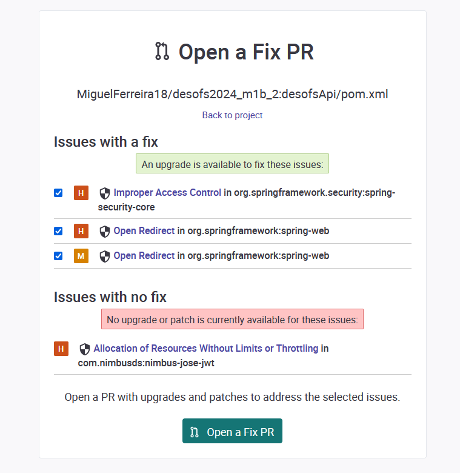

Por fim temos o Docker Scout que é uma ferramenta que faz análise de vulnerabilidades nas imagens do docker, esta
análise é feita durante a pipeline e o report é criado como um github comment na pull request, os detalhes a cerca
da action presente no workflow foram falados anteriormente.

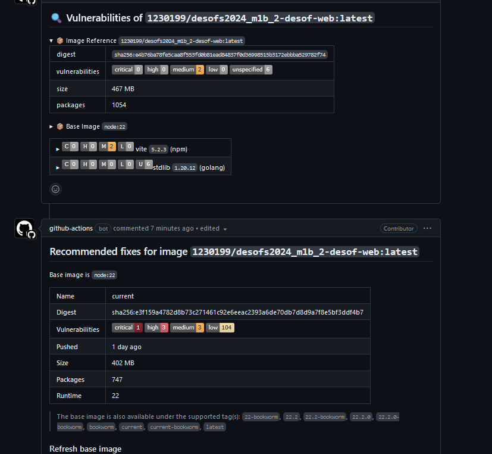

Esta ferramenta foi escolhida pois, para além de ser importante saber as dependências que estão a ser usadas, é também
igualmente importante saber as vulnerabilidades que as imagens do docker contêm.

# 8 Testes de segurança

Neste sprint foram realizados testes unitários de segurança, estes testes deviam ter sido préviamente planeados, que foi
uma das nossas falhas a ser apontada na fase de design. Apesar da nossa falha, fizemos os testes o mais uniformes
possível e principalmente focados em testar para alguns ataques comuns, como XSS, sql Injection, code injection, entre
outros. Não obstante, também testamos para as regras de negócio, sendo assim uma mistura de testes de segurança com
testes de segurança de negócio (ou seja, testes de segurança feitos para garantir que as regras de negócio estão
a ser cumpridas). Para estes testes decidimos fazer, apenas para os points of failures, neste caso na entrada da
request, por isso, os testes foram dirigidos especialmente aos DTOS de request de save e update.

```java

@ParameterizedTest
@CsvSource({
//            ...
        "<svg onload svg onload=\"javascript:javascript:alert(1)\"></svg onload>",
        "<html onmousemove html onmousemove=\"javascript:javascript:alert(1)\"></html onmousemove>",
        "<body onblur body onblur=\"javascript:javascript:alert(1)\"></body onblur>",
        "\\x3Cscript>javascript:alert(1)</script>",
        "'\"`><script>/* *\\x2Fjavascript:alert(1)// */</script>",
        "<script>javascript:alert(1)</script\\0D",
        "<script>javascript:alert(1)</script\\0A",
        "<script>javascript:alert(1)</script\\0B",
        "<script charset=\"\\x22>javascript:alert(1)</script>",
        "<!--\\x3E -->",
        "--><!-- --->  -->",
        "--><!-- --\\x00>  -->",
        "<image/src/onerror=prompt(8)>",
        "",
        "<image src/onerror=prompt(8)>",
        "",
        "<image src =q onerror=prompt(8)>",
        "",
        "</scrip</script>t>",
        "'-prompt(8)-'",
        "\"-prompt(8)-\"",
        "\";a=prompt,a()//\"",
        "\"';a=prompt,a()//\"",
        "'-eval(\"window['pro'%2B'mpt'](8)\")-'",
        "\"-eval(\"window['pro'%2B'mpt'](8)\")-\"",
})
@DisplayName("Security Test for PacoteDTOSaveRequest")
public void testSecurityVulnerabilitiesForSave(String text) {
    PacoteDTOSaveRequest response = new PacoteDTOSaveRequest(text, 2.0, text, true, 1L);
    Set<ConstraintViolation<PacoteDTOSaveRequest>> violations = validator.validate(response);
    assertFalse(violations.isEmpty());
}
```

Este é apenas um pequeno exemplo truncado dos testes que foram feitos para testar possiveis ataques. Estes testes
foram feitos para os DTOS de request de save e update, e foram feitos para garantir que a entrada de dados é segura e
que não é possivel fazer ataques comuns.

```java

@ParameterizedTest
@CsvSource(textBlock =
        """
                -124
                -35
                -1
                501
                502
                56789
                3214
                63446        
                """)
@DisplayName("Security Test for PacoteBasePrice")
public void testSecurityVulnerabilitiesForPacoteBasePrice(Double value) {
    PacoteDTOSaveRequest response = new PacoteDTOSaveRequest("random name", value, "Random text", true, 1L);
    Set<ConstraintViolation<PacoteDTOSaveRequest>> violations = validator.validate(response);
    assertFalse(violations.isEmpty());
}
```

O código acima é um exemplo de um teste de segurança de negócio, neste caso, testamos para um valor que não
deveria ser aceite, visto que o preço base, segundo as regras não pode custar menos de 0 euros e mais de 500 euros, e
por isso, o teste deveria falhar.

# 9 Testes unitários e de integração

Os testes unitários e de integração foram realizados à medida que o código era desenvolvido, sendo feitos para garantir
que o código funcionava corretamente e que as regras de negócio eram cumpridas.

```java

@SpringBootTest
class TipoPacoteServiceImplTest {

    @Autowired
    private TipoPacoteServiceRepo tipoPacoteServiceRepo;
    @Autowired
    private TipoPacoteService tipoPacoteService;
    @Autowired
    private ReceitaServiceRepo receitaRepo;


    @Autowired
    private PacoteServiceRepo pacoteServiceRepo;
    @Autowired
    private ReviewServiceRepo reviewServiceRepo;
    @Autowired
    private UserServiceRepo userServiceRepo;
    @Autowired
    private EncomendaServiceRepo encomendaServiceRepo;

    private Validator validator;

    @BeforeEach
    public void setUp() {
        encomendaServiceRepo.deleteAll();
        receitaRepo.deleteAll();
        reviewServiceRepo.deleteAll();
        userServiceRepo.deleteAll();
        pacoteServiceRepo.deleteAll();
        tipoPacoteServiceRepo.deleteAll();

        TipoPacote tp1 = new TipoPacote(1L, "Mediteraneo");
        TipoPacote tp2 = new TipoPacote(2L, "Tropical");
        TipoPacote tp3 = new TipoPacote(3L, "Tuga");
        TipoPacote tp4 = new TipoPacote(4L, "MultiCultural");
        TipoPacote tp5 = new TipoPacote(5L, "Dieta");
        tipoPacoteServiceRepo.save(tp1);
        tipoPacoteServiceRepo.save(tp2);
        tipoPacoteServiceRepo.save(tp3);
        tipoPacoteServiceRepo.save(tp4);
        tipoPacoteServiceRepo.save(tp5);


        ValidatorFactory validatorFactory = Validation.buildDefaultValidatorFactory();
        validator = validatorFactory.getValidator();
    }

    @AfterEach
    public void tearDown() {
        receitaRepo.deleteAll();
        pacoteServiceRepo.deleteAll();
        tipoPacoteServiceRepo.deleteAll();
    }

    @ParameterizedTest
    @CsvSource({
            "Mediteraneo",
            "Tropical",
            "Tuga",
            "MultiCultural",
            "Dieta"
    })
    public void testSaveTipoPacoteSuccess(String tipo) {
        tipoPacoteServiceRepo.deleteAll();

        TipoPacoteDTOServiceRequest tipoPacoteDTOServiceRequest = new TipoPacoteDTOServiceRequest(tipo);

        Set<ConstraintViolation<TipoPacoteDTOServiceRequest>> violations = validator.validate(tipoPacoteDTOServiceRequest);

        TipoPacoteDTOServiceResponse pacoteDTOServiceResponse = tipoPacoteService.save(tipoPacoteDTOServiceRequest);

        assertEquals(pacoteDTOServiceResponse.getNome(), tipoPacoteDTOServiceRequest.getNome());
        assertTrue(violations.isEmpty());

    }

    @ParameterizedTest
    @CsvSource({
            "Mediteraneo??___sad2 ii329",
            "Tropicaladsc;l ,;l ,23-0mb02$#> T>E ",
            "Tuga-=35y -=]a[s ;[",
            "<script>alert('XSS')</script>",
            "'); DROP TABLE receita; --"
    })
    public void testSaveTipoPacoteFail(String tipo) {
        tipoPacoteServiceRepo.deleteAll();

        TipoPacoteDTOServiceRequest tipoPacoteDTOServiceRequest = new TipoPacoteDTOServiceRequest(tipo);

        Set<ConstraintViolation<TipoPacoteDTOServiceRequest>> violations = validator.validate(tipoPacoteDTOServiceRequest);
        TipoPacoteDTOServiceResponse pacoteDTOServiceResponse = null;
        try {
            pacoteDTOServiceResponse = tipoPacoteService.save(tipoPacoteDTOServiceRequest);
        } catch (Exception e) {
            assertNull(pacoteDTOServiceResponse);
        }
        assertNull(pacoteDTOServiceResponse);
        assertFalse(violations.isEmpty());
    }

    @ParameterizedTest
    @CsvSource({
            "-1",
            "-2",
            "-304305890",
            "-48345875",
            "-534568"
    })
    public void testSaveTipoPacoteFailId(Long tipo) {
        TipoPacoteDTOServiceResponse pacoteDTOServiceResponse = tipoPacoteService.findbyId(tipo);

        assertNull(pacoteDTOServiceResponse);
    }

    @Test
    public void testFindAllTipoPacoteSuccess() {
        List<TipoPacoteDTOServiceResponse> tipoPacoteDTOServiceResponseList = tipoPacoteService.findAll();
        TipoPacoteDTOServiceResponse tipoPacoteDTOServiceResponse = tipoPacoteService.findAll().get(0);

        assertNotNull(tipoPacoteDTOServiceResponse);
        assertEquals(tipoPacoteDTOServiceResponseList.size(), 5);
    }

    @Test
    public void testDeleteAllTipoPacoteSuccess() {
        tipoPacoteService.deleteAll();
        List<TipoPacoteDTOServiceResponse> tipoPacoteDTOServiceResponseList = tipoPacoteService.findAll();

        assertTrue(tipoPacoteDTOServiceResponseList.isEmpty());
    }


}
```

Aqui temos um exemplo de um teste de integração, neste caso, testamos o serviço de TipoPacote, cujo propósito é
gerir os tipos de pacotes que a aplicação tem. Neste caso, testamos para o save, findAll e deleteAll, e testamos para
casos de sucesso e de falha.

## 10 Backend

O backend foi desenvolvido em Java, com o uso do Spring Boot, que é uma framework que facilita o desenvolvimento de
aplicações web. O backend foi dividido em 3 camadas, a camada controller, service e repository, seguindo uma
estrutura Onion. A camanda Controller é responsável por receber as requests, a camada service é responsável por
implementar a lógica de negócio e a camada repository é responsável por interagir com a base de dados.

### 10.1 SecurityConfig

O nosso programa, contém uma classe chamada SecurityConfig, que é responsável por configurar a segurança da
aplicação.Através
desta, é possível configurar o login, logout, e as permissões de cada endpoint. Assim,
conseguimos garantir que apenas pessoas autorizadas possam aceder a certos endpoints.

```java
.requestMatchers("/pacote/**").

hasRole(Role.Admin)
.

requestMatchers("/pacote/**").

hasRole(Role.GestorFicheiros)
.

requestMatchers("/review/all").

permitAll()
.

requestMatchers("/review/pacote/**").

permitAll()
.

requestMatchers("/review/**").

authenticated()
```

Aqui, podemos perceber diferentes permissões para diferentes endpoints, por exemplo, para qualquer endpoint
que comece por /pacote poderá ser acedido por um Admin ou por um Gestor de Ficheiros, enquanto que para o endpoint
/review/all e /review/pacote qualquer pessoa pode aceder, porém para os restantes endpoints que comecem por /review
apenas pessoas autenticadas podem aceder.

### 10.2 DTOs

Para a comunicação entre as diversas camadas da aplicação, foram usados DTOs, que são objetos que contêm apenas os
atributos necessários para a comunicação entre estas. Estes objetos são usados para garantir que a comunicação
entre as camadas é eficiente e segura.

Além disso, utilizou-se mappers para converter os DTOs em entidades e vice-versa.
Esses mappers desempenham um papel crucial na comunicação entre as camadas da aplicação,
assegurando que os dados sejam convertidos de forma adequada e consistente.
Eles garantem que os objetos sejam mapeados corretamente de acordo com as
necessidades de cada camada, facilitando assim a comunicação
e a interoperabilidade entre elas.

```java

@Mapper(componentModel = "spring")
@Component
public interface EncomendaMapper {
    //Controller Layer
    EncomendaDTOServiceRequest toEncomendaDtoServiceRequestFromEncomendaDtoSaveRequest(EncomendaDTOSaveRequest encomendaDTOSaveRequest);

    EncomendaDTOResponse fromEncomendaToDto(EncomendaDTOServiceResponse encomenda);

    List<EncomendaDTOResponse> fromEncomendaDtoServiceResponseListToEncomendaDToResponseList(List<EncomendaDTOServiceResponse> all);

    EncomendaDTOServicePatchRequest toEncomendaDTOServicePatchRequestFromEncomendaDTOPatchRequest(EncomendaDTOPatchRequest encomenda);

    //Service Layer
    EncomendaDTOServiceResponse toEncomendaDTOServiceResponseFromEncomenda(Encomenda encomenda);

    Encomenda toEncomendafromEncomendaSaveDtoService(EncomendaSaveDTOService encomendaDTOServiceRequest);

    List<EncomendaDTOServiceResponse> toEncomendaDTOServiceResponseListFromEncomendaList(List<Encomenda> all);

    Encomenda toEncomendafromEncomendaPatchDtoService(EncomendaPatchDTOService encomendaPatchDTOService);
}
```

O código apresentado é um exemplo de um mapper utilizado para a entidade "Encomenda".
Ele define métodos para converter objetos relacionados à "Encomenda" entre as camadas controller e service,
garantindo uma comunicação eficiente e semântica entre essas partes da aplicação.
Esta abordagem ajuda a manter um código limpo e modular, facilitando a manutenção
e a evolução da aplicação ao longo do tempo.

### 10.3 Validações de input

Nos nossos DTOs e model classes, foram usadas anotações de validação para garantir que os
dados inseridos são válidos e seguros. Estas anotações são usadas para validar os campos
de forma a prevenir erros e ataques comuns, como SQL Injection e Cross-Site Scripting (XSS).

```java

@Entity
public class Encomenda {
    @Id
    @GeneratedValue
    private Long encomendaId;
    @Min(value = 1, message = "Número de refeições por semana inválido")
    @Max(value = 7, message = "Número de refeições por semana inválido")
    @Positive
    private int mealsPerWeek;

    @Min(value = 1, message = "Número de pessoas inválido")
    @Max(value = 5, message = "Número de pessoas inválido")
    @Positive
    private int numberOfPeople;
    @Min(value = 1, message = "Preço inválido")
    @Positive
    private double price;
    @JsonFormat(pattern = "yyyy-MM-dd HH:mm:ss")
    private LocalDateTime dataEncomenda;
    @ManyToOne
    @NotNull(message = "Pacote inválido")
    private Pacote pacote;

    @Enumerated(EnumType.STRING)
    private Estado estado;

    @ManyToOne
    @NotNull(message = "User inválido")
    private User user;
```

Neste exemplo, podemos ver a utilização de anotações de validação para garantir que os campos
da entidade "Encomenda" são válidos e seguros, como por exemplo a garantia de que o número de refeições
por semana é um valor entre 1 e 7, que o número de pessoas é um valor entre 1 e 5, e que o preço é um valor positivo.
Desta forma, podemos garantir que os dados inseridos cumprem as nossas regras de negócio e que são seguros contra
ataques.

```java

@Entity
@ToString
public class Pacote {

    @Id
    @GeneratedValue
    private Long pacoteId;


    @Pattern(regexp = "^[a-zA-Z0-9 ]*$", message = "Nome do pacote inválido")
    private String nome;

    @Min(value = 0, message = "Peço do pacote inválido")
    @Max(value = 400, message = "Peço do pacote inválido")
    private double pacoteBasePrice;

    @Pattern(regexp = "^[a-zA-Z0-9 ]*$", message = "Descrição do pacote inválida")
    private String pacoteDescription;

    @NotNull
    private boolean disabled;

    @ManyToOne
    @NotNull
    private TipoPacote tipoPacote;
```

Já neste exemplo, podemos ver a utilização de anotações de validação para garantir que os campos
do tipo String são protegidos também através de uma regex, garantindo que apenas letras e números são aceites,
prevenindo principalmente ataques de XSS.

## 11 Front end

Para o desenvolvimento do front end, foi utilizado a framework Sveltekit, que é uma framework de front end que permite
desenvolver aplicações web de forma rápida e eficiente.
Como forma de garantir uma maior segurança, foram utilizadas algumas práticas de segurança, como por exemplo, a
validação de inputs, a utilização de tokens de autenticação e a proteção contra ataques de XSS e CSRF.

### 11.1 Autenticação

Para garantir a autenticação dos utilizadores, foi utilizado um Bearer Token, que é um token de autenticação
que é gerado pelo servidor e enviado para o cliente, que o guarda e o envia em todas as requests para o servidor.
Este token é utilizado para autenticar o utilizador e garantir que apenas utilizadores autenticados possam aceder a
certos endpoints.

```svelte
<div class="self-center">
		{#if data.user}
			<Button className="profile-button" text="Perfil" gotoName="/profile" />
			<Button className="order-button" text="Carrinho" gotoName="/carrinho" />
			<Button className="enc-button" text="Encomenda" gotoName="/encomenda" />
			{#if data.user.isAdmin || data.user.isDocumentManager}
				<Button
					className="package-management-button"
					text="Gestão de pacotes"
					gotoName="/package-management"
				/>

				<Button className="recipe-management-button" text="Receitas" gotoName="/recipe" />
			{/if}
			{#if data.user}
				<Button className="dashboard-button" text="Dashboard" gotoName="/dashboard" />
			{/if}
			<Button className="logout-button" text="Sair" gotoName="/auth/logout" />
		{:else}
			<Button className="login-button" text="Junta-te" gotoName="/auth" />
		{/if}
	</div>
```

Neste exemplo, podemos ver a utilização do token para garantir que apenas utilizadores autenticados possam aceder a
certos botões, como por exemplo, o botão de logout, que apenas é visível para utilizadores autenticados.
Tambeém podemos ver que apenas utilizadores com permissões de admin ou gestor de ficheiros podem aceder a certos
botões, como por exemplo, o botão de gestão de pacotes.

### 11.2 Types

Para garantir a segurança dos dados, foram utilizados types, que são objetos que contêm apenas os atributos necessários
para a comunicação entre as diversas partes da aplicação. Estes objetos são usados para garantir que a comunicação
entre as diversas partes da aplicação é eficiente e segura.

```svelte
type RecipeDTOSend = {
	path: string;
	nome: string;
	pacote: number;
	tipoReceita: number;
};

type RecipePatchSend = {
	receitaId: number;
	path: string;
	nome: string;
	pacote: number;
	tipoReceita: number;
};

type Recipe = {
	receitaId: number;
	path: string;
	nome: string;
	pacote: Package;
	tipoReceita: RecipeType;
};

```

Neste exemplo, podemos ver a utilização de types para garantir que os dados enviados entre as diversas partes da
aplicação são seguros e consistentes, como por exemplo, o type RecipeDTOSend, que é utilizado para a
criação de uma receita. Desta forma, asseguramo-nos que enviamos
o tipo correto de dados, prevenindo o envio de uma string invés de
um número, por exemplo.

### 11.3 Validação de inputs

Para garantir que os dados inseridos são válidos e seguros, foram utilizadas algumas práticas de validação de inputs,
como por exemplo, a validação do tipo de input, tamanho máximo e mínimo, entre outros.

```svelte
<div class="flex flex-row gap-2 content-center items-center">
    <label class="min-w-40" for="meals">Number of Meals</label>
    <input
        bind:value={meals}
        type="number"
        name="meals"
        id="meals"
        class="rounded border border-current p-1 min-w-80"
        min="1"
        max="7"
    />
</div>
```

Neste exemplo, podemos ver a utilização de validação de inputs para garantir que o número de refeições inserido é
um valor entre 1 e 7 de forma a cumprir os requisitos da nossa aplicação e garantir
que os dados inseridos são válidos.

# 12 ASVS

O OWASP Application Security Verification Standard (ASVS) é um projeto que define um conjunto de requisitos de segurança
das aplicações.
Este documento descreve a utilização do ASVS e a análise efetuada através da lista de verificação fornecida.
A lista de verificação está dividida em várias categorias de segurança, cada uma contendo um conjunto de critérios que
devem ser verificados para garantir a segurança da aplicação.

## 12.1 Estrutura do Checklist

A lista de controlo ASVS é composta por diferentes categorias de segurança. Apresentamos a seguir as categorias
analisadas:

1. **Architecture, Design and Threat Modeling**
2. **Authentication**
3. **Session Management**
4. **Access Control**
5. **Validation, Sanitization and Encoding**
6. **Stored Cryptography**
7. **Error Handling and Logging**
8. **Data Protection**
9. **Communication**
10. **Malicious Code**
11. **Business Logic**
12. **Files and Resources**
13. **API and Web Service**
14. **Configuration**

## 12.2 ASVS Results Overview

O ficheiro Excel apresenta uma síntese dos resultados da ASVS para cada categoria de segurança.
Segue-se um resumo dos resultados, incluindo o número de critérios válidos, o total de critérios e a percentagem de
validade para cada categoria.

| Security Category                        | Total Criteria | Valid Criteria | Validity Percentage |
|------------------------------------------|----------------|----------------|---------------------|
| Architecture, Design and Threat Modeling | 33             | 28             | 84.85%              |
| Authentication                           | 35             | 21             | 60.00%              |
| Session Management                       | 14             | 10             | 71.43%              |
| Access Control                           | 8              | 6              | 75.00%              |
| Validation, Sanitization and Encoding    | 27             | 22             | 81.48%              |

De reforçar que no ficheiro do ASVS, as funcionalidades que estão assinaladas com "valid", são funcionalidades que já
foram implementadas,
as que estão assinaladas com "not-valid", são funcionalidades que pretendemos implementar no futuro, e as que estão
assinaladas com "not-applicable".

### 12.2.1 Detalhes por Categoria

#### 12.2.1.1. Architecture, Design and Threat Modeling

Esta categoria verifica a existência de uma arquitetura de segurança bem definida e a utilização de modelos de ameaças
para identificar possíveis vulnerabilidades.
A validade desta categoria é de 84,85%, com 28 critérios válidos num total de 33.

- **Existência de uma arquitetura de segurança:** Garante que a aplicação tem uma arquitetura de segurança documentada e
  implementada.
- **Modelação de ameaças:** Utiliza modelos de ameaças para identificar, quantificar e mitigar potenciais riscos.
- **Conceção segura:** Avalia se a conceção da aplicação incorpora princípios de segurança, como a defesa em
  profundidade e o princípio do menor privilégio.

##### 12.2.1.1.1 Exemplos de implementação

**Verify that the application uses a single vetted authentication mechanism that is known to be secure, can be extended
to include strong authentication, and has sufficient logging and monitoring to detect account abuse or breaches.**

Para este ponto de verificação, a nossa solução foi a utilização do JWT que é facilmente extensivel de forma a adicionar
mecanismos de logging.

````java

@Bean
public JwtEncoder jwtEncoder() {
    final JWK jwk = new RSAKey.Builder(this.rsaPublicKey).privateKey(this.rsaPrivateKey).build();
    final JWKSource<SecurityContext> jwks = new ImmutableJWKSet<>(new JWKSet(jwk));
    return new NimbusJwtEncoder(jwks);
}

@Bean
public JwtDecoder jwtDecoder() {
    return NimbusJwtDecoder.withPublicKey(this.rsaPublicKey).build();
}

@Bean
public JwtAuthenticationConverter jwtAuthenticationConverter() {
    final JwtGrantedAuthoritiesConverter jwtGrantedAuthenticationConverter = new JwtGrantedAuthoritiesConverter();
    jwtGrantedAuthenticationConverter.setAuthoritiesClaimName("roles");
    jwtGrantedAuthenticationConverter.setAuthorityPrefix("ROLE_");

    final JwtAuthenticationConverter jwtAuthenticationConverter = new JwtAuthenticationConverter();
    jwtAuthenticationConverter.setJwtGrantedAuthoritiesConverter(jwtGrantedAuthenticationConverter);
    return jwtAuthenticationConverter;
}
````

** Verify that input validation is enforced on a trusted service layer. **

Para este ponto, foram implementadas mecanismos de sanitização dos inputs, através de annotations disponibilizadas pelo
lombok e o jpa.

````java

@NotNull
@Positive
private final Long pacoteId;

@NotBlank
@Pattern(regexp = "^[a-zA-Z0-9 ]*$", message = "Nome do pacote inválido")
@Size(min = 1, message = "Nome do pacote inválido")
@Size(max = 16, message = "Nome do pacote inválido")
private final String nome;

@Min(value = 0, message = "Preço base do pacote inválido")
@Max(value = 500, message = "Preço base do pacote inválido")
private final double pacoteBasePrice;

@Size(min = 1, message = "Descrição do pacote inválida")
@Size(max = 64, message = "Descrição do pacote inválida")
@Pattern(regexp = "^[a-zA-Z0-9 ]*$", message = "Descrição do pacote inválida")
private final String pacoteDescription;

private final boolean disabled;
@Positive
@NotNull
private final Long tipoPacote;
````

#### 12.2.1.2. Authentication

A autenticação é essencial para garantir que apenas os utilizadores autorizados possam aceder ao sistema. Nesta
categoria, a validade é de 60,00%, com 21 critérios válidos num total de 35.

- **Mecanismos de autenticação:** Verifica se são utilizados mecanismos de autenticação seguros, como a autenticação
  multifactor.
- **Proteção de credenciais:** Garante que as credenciais de autenticação são protegidas durante o armazenamento e a
  transmissão.
- **Gestão de sessões:** Avalia se as sessões de autenticação são geridas de forma segura, incluindo a expiração e
  revogação da sessão.

##### 12.2.1.2.1 Exemplos de implementação

** Verify that user set passwords are at least 12 characters in length **

Para este ponto de verificação, a nossa solução foi a utilização de uma annotation para garantir que a password tem pelo
menos 12 caracteres.

````java

@NotBlank
@Size(min = 12, message = "Password must be at least 12 characters long")
private final String password;
````

Não só no backend mas no frontend também adicionamos essa restrição, mas a implementação principal é a do backend devido
à sua maior segurança.

** Verify that passwords of at least 64 characters are permitted, and that passwords of more than 128 characters are
denied. **

Para este ponto de verificação, muito parecido com o ponto acima, a nossa solução foi a utilização de uma annotation
para garantir que a password tem pelo menos 64 caracteres e no máximo 128.

````java

@NotBlank
@Size(min = 64, message = "Password must be at least 64 characters long")
@Size(max = 128, message = "Password must be at most 128 characters long")
private final String password;
````

#### 12.2.1.3. Session Management

A gestão de sessões garante que as sessões dos utilizadores estão seguras e protegidas contra-ataques. A validade desta
categoria é de 71,43%, com 10 critérios válidos num total de 14.

- **Gestão de sessões:** Verifica se as sessões são geridas corretamente, incluindo a criação, a manutenção e o
  encerramento seguro das sessões.
- **Proteção contra-ataques a sessões:** Avalia a proteção contra-ataques como a fixação de sessões, o desvio de sessões
  e a reutilização de fichas de sessão.
- **Expiração da sessão:** Garante que as sessões expiram após um período de inatividade ou após um período predefinido.

##### 12.2.1.3.1 Exemplos de implementação

** Verify the application never reveals session tokens in URL parameters or error messages. **

Para este ponto de verificação, a nossa solução é que o backend só retorna o token de sessão quando o utilizador insere
corretamente as credenciais.
Nos restantes pedidos essa informação não é partilhada.

```` java
    @PostMapping("login")
    public ResponseEntity<UserView> login(@RequestBody @Valid final SignInRequest request) {
        try {
            final Authentication authentication = authenticationManager.authenticate(new UsernamePasswordAuthenticationToken(request.username(), request.password()));
            final User user = (User) authentication.getPrincipal();
            final Instant now = Instant.now();
            final long expiry = 36000L;

            final String scope = authentication.getAuthorities().stream().map(GrantedAuthority::getAuthority)
                    .collect(joining(" "));

            final JwtClaimsSet claims = JwtClaimsSet.builder().issuer("example.io").issuedAt(now)
                    .expiresAt(now.plusSeconds(expiry)).subject(format("%s,%s", user.getUserId(), user.getUsername()))
                    .claim("roles", scope).build();

            final String token = this.jwtEncoder.encode(JwtEncoderParameters.from(claims)).getTokenValue();
            return ResponseEntity.ok().header(HttpHeaders.AUTHORIZATION, token).body(mapToUSerView(user));
        } catch (final BadCredentialsException ex) {
            return ResponseEntity.status(HttpStatus.UNAUTHORIZED).build();
        }
    }
````

** Verify the application only stores session tokens in the browser using secure methods such as appropriately secured
cookies **

Para este ponto de verificação, a nossa solução foi armazenar a token de sessão utilizando secure cookies já fornecidas
pelo sveltekit.

```` svelte
    import { setCookie } from 'svelte-cookie';
    setCookie('token', token, { path: '/', secure: true, sameSite: 'strict' });
````

#### 12.2.1.4. Access Control

O controlo do acesso garante que os utilizadores só podem aceder aos recursos para os quais têm permissão. A validade
desta categoria é de 75,00%, com 6 critérios válidos num total de 8.

- **Políticas de Controlo de Acesso:** Verifica a existência de políticas de controlo de acesso bem definidas e
  implementadas.
- **Autorização de Acesso:** Avalia se os mecanismos de autorização garantem que os utilizadores só podem aceder aos
  recursos permitidos.
- **Segregação de funções:** Assegura que as diferentes funções dos utilizadores estão segregadas para minimizar o risco
  de abuso de privilégios.

##### 12.2.1.4.1 Exemplos de implementação

** Verify that all user and data attributes and policy information used by access controls cannot be manipulated by end
users unless specifically authorized. **

Para este ponto de verificação, a nossa solução definiu roles para os utilizadores, e esses roles são verificados em
cada pedido para garantir que o utilizador tem permissão para aceder a esse recurso.

````java
                        auth ->auth
        .

requestMatchers("/auth/public/signup").

permitAll()
                                .

requestMatchers("/auth/public/login").

permitAll()
                                .

requestMatchers("/pacote/all").

permitAll()
                                .

requestMatchers("/pacote/get/**").

permitAll()
                                .

requestMatchers("/pacote/**").

hasRole(Role.Admin)
                                .

requestMatchers("/pacote/**").

hasRole(Role.GestorFicheiros)
                                .

requestMatchers("/review/all").

permitAll()
                                .

requestMatchers("/review/pacote/**").

permitAll()
                                .

requestMatchers("/review/**").

authenticated()
                                .

requestMatchers("/tipoPacote/**").

authenticated()
                                .

requestMatchers("/encomenda/**").

authenticated()
                                .

requestMatchers("/user/info/**").

authenticated()
                                .

requestMatchers("/encomenda/**").

authenticated()
                                .

requestMatchers("/user/delete/data").

authenticated()
                                .

requestMatchers("/tipoReceita/**").

authenticated()
                                .

requestMatchers("/receita/**").

authenticated()
                                .

requestMatchers("/api-docs/**").

permitAll()
                                .

requestMatchers("/swagger-ui/**").

permitAll()
````

#### 12.2.1.5. Validation, Sanitization and Encoding

A validação, a higienização e a codificação dos dados são essenciais para evitar ataques de injeção e outras
vulnerabilidades. A validade nesta categoria é de 81,48%, com 22 critérios válidos num total de 27.

- **Validação de dados de entrada:** Verifica se todos os dados de entrada são validados para garantir que estão dentro
  dos limites esperados.
- **Sanitização de dados:** Garante que todos os dados de entrada são devidamente sanitizados para remover ou
  neutralizar qualquer conteúdo malicioso.
- **Codificação de saída:** Avalia se os dados estão corretamente codificados antes de serem enviados para o cliente
  para evitar ataques como XSS (Cross-Site Scripting).

##### 12.2.1.5.1 Exemplos de implementação

** Verify that the application has defenses against HTTP parameter pollution attacks **

Para este ponto de verificação, a nossa solução foi a utilização de funções nativas do springboot.

````java
        http.headers(headers ->headers.

frameOptions(HeadersConfigurer.FrameOptionsConfig::sameOrigin)
                        .

httpStrictTransportSecurity(hsts ->hsts
        .

includeSubDomains(true)
                                .

preload(true)
                                .

maxAgeInSeconds(31536000)
                        )
                                .

xssProtection(xss ->xss.

headerValue(XXssProtectionHeaderWriter.HeaderValue.ENABLED_MODE_BLOCK))
        .

referrerPolicy(referrerPolicy ->referrerPolicy.

policy(ReferrerPolicyHeaderWriter.ReferrerPolicy.SAME_ORIGIN))
        )
````

** Verify that the application protects against SSRF attacks, by validating or sanitizing untrusted data or HTTP file
metadata, such as filenames and URL input fields, and uses allow lists of protocols, domains, paths and ports. **

Para este ponto de verificação, foi utilizada a mesma solução, que é a utilização de funções nativas do springboot.

````java
        http.headers(headers ->headers.

frameOptions(HeadersConfigurer.FrameOptionsConfig::sameOrigin)
                        .

httpStrictTransportSecurity(hsts ->hsts
        .

includeSubDomains(true)
                                .

preload(true)
                                .

maxAgeInSeconds(31536000)
                        )
                                .

xssProtection(xss ->xss.

headerValue(XXssProtectionHeaderWriter.HeaderValue.ENABLED_MODE_BLOCK))
        .

referrerPolicy(referrerPolicy ->referrerPolicy.

policy(ReferrerPolicyHeaderWriter.ReferrerPolicy.SAME_ORIGIN))
        )
````

## 12.3 Conclusão

A análise da lista de verificação ASVS revelou que, embora existam áreas de forte conformidade, como a Arquitetura, a
Conceção e a Modelação e Validação de Ameaças, a Sanitização e a Codificação, também existem áreas que necessitam de ser
melhoradas, como a Autenticação e a Gestão de Sessões.
A utilização da ASVS como guia permite identificar e dar prioridade a áreas que necessitam de ser melhoradas na
segurança das aplicações.

Este resumo fornece uma visão geral dos resultados da ASVS, destacando a importância de uma abordagem sistemática à
segurança das aplicações.
A continuidade na implementação e verificação dos requisitos da ASVS garantirá a melhoria contínua da segurança do
sistema.

## 13 Implementações futuras

Como mencionado anteriormente, durante a explicação de alguns pontos do ASVS, existem funcionalidades que ainda não
foram implementadas devido ao calendário de desenvolvimento.
No entanto, a maioria das funcionalidades de maior prioridade já foram implementadas, o que realça a importância de uma
revisão cuidadosa destes domínios.
Prevemos que os nossos próximos passos incluam a finalização das tarefas restantes, a realização da implementação, uma
revisão de tudo o que já foi feito, a adição de um sistema de logs e a implementação do “release please”,
que mesmo já estando implementado queremos usar melhor das suas capacidades, mais especificamente para separar a última
implementação das versões anteriores.

# 2º Sprint

## Use and Abuse case mitigations

### User Authentication

#### Ataque de força bruta

É de notar que não foram implementados mecanismos de controlo de ataques de força bruta. No entanto, foram consideradas várias soluções com potencial, incluindo:

CAPTCHA: A introdução de um CAPTCHA após um determinado número de tentativas de início de sessão falhadas serve para garantir que a conta é acedida por um ser humano e não por um bot.

Verificação de IP: A monitorização das tentativas de início de sessão a partir de endereços IP desconhecidos ou suspeitos permite bloquear ou solicitar uma verificação adicional (como um código enviado por email) em caso de atividade invulgar.

Autenticação multifactor (MFA): A implementação da autenticação multifactor representa uma camada adicional de segurança, exigindo não só a palavra-passe mas também um código enviado para o dispositivo do utilizador.

Notificações de tentativa de login: A transmissão de notificações ao utilizador após a ocorrência de tentativas de login falhadas na sua conta serve para alertar o utilizador para a possibilidade de ataques de força bruta e para o encorajar a tomar medidas, tais como alterar a sua palavra-passe.

Limitação da taxa: Implementar uma limitação na taxa de pedidos ao ponto final de início de sessão, impedindo um grande número de tentativas de início de sessão num curto período de tempo.

Lista de IPs bloqueados: Manter uma lista de endereços IP conhecidos por terem sido alvo de força bruta e bloqueá-los automaticamente.

#### Injeção de SQL

Para mitigar este ataque, todos os nossos dtos têm regex para detetar caracteres especiais e impedir a
injeção de SQL.

```java

@Pattern(regexp = "^[a-zA-Z0-9 ]+$", message = "Texto inválido")
private String reviewText;
```

Esse regex apenas permite letras, números e espaços, impedindo a injeção de SQL.

#### Ataque de Dicionario

Para mitigar este ataque temos impostas regras que não permitem que certos tipos de palavras pass sejam possiveis de
serem usadas.

-- Falta pôr a imagem com a força da palavra pass (Rodrigo)

### User Order

#### Ataque de spam de comentários

Aqui apenas podemos validar a review do utilizador, para não ser possível enviar reviews com conteúdo malicioso.

```java

@NotBlank
@Pattern(regexp = "^[a-zA-Z0-9 ]+$", message = "Texto inválido")
private String reviewText;

@Min(value = 0, message = "Rating inválido")
@Max(value = 5, message = "Rating inválido")
@Positive
private int rating;
```

#### Ataque de injeção de SQL

Para mitigar este problema usamos na mesma o regex para validar o texto da review, impedindo a injeção de SQL.

### File manager

### Administrator

#### Ataque "privilege escalation"

A melhor forma de mitigar este ataque é garantir que os utilizadores apenas têm acesso às funcionalidades que lhes são
permitidas e que existe um sistema de autenticação e autorização.

```java

@Bean
public SecurityFilterChain securityFilterChain(HttpSecurity http) throws Exception {
    // TODO ADICIONAR PERMISSÕES À MEDIDA QUE SE VAI FAZENDO O WEBSITE


    // Enable CORS and disable CSRF
    http.headers(headers -> headers.frameOptions(HeadersConfigurer.FrameOptionsConfig::sameOrigin)
                    .httpStrictTransportSecurity(hsts -> hsts
                            .includeSubDomains(true)
                            .preload(true)
                            .maxAgeInSeconds(31536000)
                    )
                    .xssProtection(xss -> xss.headerValue(XXssProtectionHeaderWriter.HeaderValue.ENABLED_MODE_BLOCK))
                    .referrerPolicy(referrerPolicy -> referrerPolicy.policy(ReferrerPolicyHeaderWriter.ReferrerPolicy.SAME_ORIGIN))
            )
            .cors(cors -> cors.configurationSource(request -> {
                CorsConfiguration config = new CorsConfiguration();
                config.setAllowedOriginPatterns(Arrays.asList("*"));
                config.setAllowedMethods(Arrays.asList("GET", "POST", "DELETE", "OPTIONS", "PATCH"));
                config.setAllowedHeaders(Arrays.asList("*"));
                config.setExposedHeaders(Arrays.asList(HttpHeaders.AUTHORIZATION));
                config.setAllowCredentials(true);
                return config;
            }))
            .csrf(Customizer.withDefaults()).csrf(httpSecurityCsrfConfigurer -> httpSecurityCsrfConfigurer.ignoringRequestMatchers("/auth/public/**"))
            .sessionManagement(session -> session.sessionCreationPolicy(SessionCreationPolicy.STATELESS))
            .authorizeHttpRequests(
                    auth -> auth
                            .requestMatchers("/auth/public/signup").permitAll()
                            .requestMatchers("/auth/public/login").permitAll()
                            .requestMatchers("/pacote/all").permitAll()
                            .requestMatchers("/pacote/get/**").permitAll()
                            .requestMatchers("/pacote/**").hasRole(Role.Admin)
                            .requestMatchers("/pacote/**").hasRole(Role.GestorFicheiros)
                            .requestMatchers("/review/all").permitAll()
                            .requestMatchers("/review/pacote/**").permitAll()
                            .requestMatchers("/review/**").authenticated()
                            .requestMatchers("/tipoPacote/**").authenticated()
                            .requestMatchers("/encomenda/**").authenticated()
                            .requestMatchers("/user/info/**").authenticated()
                            .requestMatchers("/encomenda/**").authenticated()
                            .requestMatchers("/user/delete/data").authenticated()
                            .requestMatchers("/tipoReceita/**").authenticated()
                            .requestMatchers("/receita/**").authenticated()
                            .requestMatchers("/api-docs/**").permitAll()
                            .requestMatchers("/swagger-ui/**").permitAll()

            )
            .httpBasic(Customizer.withDefaults()).oauth2ResourceServer((oauth) -> oauth.jwt(Customizer.withDefaults()))
            .authenticationProvider(authenticationProvider());
    return http.build();

}
```

Por exemplo, neste código, podemos ver apenas utilizadores autenticados podem aceder a certos endpoints, e que
apenas utilizadores com permissões de admin ou gestor de ficheiros podem aceder a certos endpoints. Além disso, usamos o
JWT para fazer a autenticação dos utilizadores, de modo a não usarmos keys ou passwords para efetuar requests. Estes
tokens são revogados ao fim de 1 hora, garantindo que mesmo que alguém consiga obter o token, este é inválido passado
esse tempo.

## Countermeasures Stride

### Spoofing

**Countermeasure 1**

A implementação da autenticação de dois factores não foi prosseguida devido à ausência de um servidor para a transmissão de mensagens de correio eletrónico ou mensagens para os dispositivos móveis dos utilizadores.

**Countermeasure 2** (Rodrigo)

Foi implementado na nossa solução as seguintes caracteristicas:

- Exigir uma senha forte, com pelo menos 12 caracteres.
- A senha deve incluir letras minúsculas, maiúsculas, símbolos e números.
- Reduzir múltiplos espaços consecutivos a um único espaço.
- Indicador do nivel de força da password

**Countermeasure 3**

Aqui foi implementado o JWT para impedir possiveis ataques de spoofing, uma vez que o token é gerado pelo servidor e
este indica o role do utilizador, impedindo assim que um utilizador comum possa aceder a endpoints que não deva.

```java

@Configuration
@EnableWebSecurity
@EnableWebMvc
@EnableMethodSecurity(securedEnabled = true, jsr250Enabled = true)
public class SecurityConfig {

    @Value("${jwt.public.key}")
    private RSAPublicKey rsaPublicKey;

    @Value("${jwt.private.key}")
    private RSAPrivateKey rsaPrivateKey;

    @Value("${springdoc.api-docs.path}")
    private String restApiDocPath;

    @Value("${springdoc.swagger-ui.path}")
    private String swaggerPath;

    @Autowired
    private UserServiceImpl userService;


    @Bean
    public SecurityFilterChain securityFilterChain(HttpSecurity http) throws Exception {
        // TODO ADICIONAR PERMISSÕES À MEDIDA QUE SE VAI FAZENDO O WEBSITE


        // Enable CORS and disable CSRF
        http.headers(headers -> headers.frameOptions(HeadersConfigurer.FrameOptionsConfig::sameOrigin)
                        .httpStrictTransportSecurity(hsts -> hsts
                                .includeSubDomains(true)
                                .preload(true)
                                .maxAgeInSeconds(31536000)
                        )
                        .xssProtection(xss -> xss.headerValue(XXssProtectionHeaderWriter.HeaderValue.ENABLED_MODE_BLOCK))
                        .referrerPolicy(referrerPolicy -> referrerPolicy.policy(ReferrerPolicyHeaderWriter.ReferrerPolicy.SAME_ORIGIN))
                )
                .cors(cors -> cors.configurationSource(request -> {
                    CorsConfiguration config = new CorsConfiguration();
                    config.setAllowedOriginPatterns(Arrays.asList("*"));
                    config.setAllowedMethods(Arrays.asList("GET", "POST", "DELETE", "OPTIONS", "PATCH"));
                    config.setAllowedHeaders(Arrays.asList("*"));
                    config.setExposedHeaders(Arrays.asList(HttpHeaders.AUTHORIZATION));
                    config.setAllowCredentials(true);
                    return config;
                }))
                .csrf(Customizer.withDefaults()).csrf(httpSecurityCsrfConfigurer -> httpSecurityCsrfConfigurer.ignoringRequestMatchers("/auth/public/**"))
                .sessionManagement(session -> session.sessionCreationPolicy(SessionCreationPolicy.STATELESS))
                .authorizeHttpRequests(
                        auth -> auth
                                .requestMatchers("/auth/public/signup").permitAll()
                                .requestMatchers("/auth/public/login").permitAll()
                                .requestMatchers("/pacote/all").permitAll()
                                .requestMatchers("/pacote/get/**").permitAll()
                                .requestMatchers("/pacote/**").hasRole(Role.Admin)
                                .requestMatchers("/pacote/**").hasRole(Role.GestorFicheiros)
                                .requestMatchers("/review/all").permitAll()
                                .requestMatchers("/review/pacote/**").permitAll()
                                .requestMatchers("/review/**").authenticated()
                                .requestMatchers("/tipoPacote/**").authenticated()
                                .requestMatchers("/encomenda/**").authenticated()
                                .requestMatchers("/user/info/**").authenticated()
                                .requestMatchers("/encomenda/**").authenticated()
                                .requestMatchers("/user/delete/data").authenticated()
                                .requestMatchers("/tipoReceita/**").authenticated()
                                .requestMatchers("/receita/**").authenticated()
                                .requestMatchers("/api-docs/**").permitAll()
                                .requestMatchers("/swagger-ui/**").permitAll()

                )
                .httpBasic(Customizer.withDefaults()).oauth2ResourceServer((oauth) -> oauth.jwt(Customizer.withDefaults()))
                .authenticationProvider(authenticationProvider());
        return http.build();

    }

    @Bean
    public AuthenticationProvider authenticationProvider() {
        DaoAuthenticationProvider provider = new DaoAuthenticationProvider();
        provider.setPasswordEncoder(passwordEncoder());
        provider.setUserDetailsService(userDetailsService());
        return provider;
    }


    @Bean
    UserDetailsService userDetailsService() {
        return userService::findByUsername;
    }


    @Bean
    public JwtEncoder jwtEncoder() {
        final JWK jwk = new RSAKey.Builder(this.rsaPublicKey).privateKey(this.rsaPrivateKey).build();
        final JWKSource<SecurityContext> jwks = new ImmutableJWKSet<>(new JWKSet(jwk));
        return new NimbusJwtEncoder(jwks);
    }

    @Bean
    public JwtDecoder jwtDecoder() {
        return NimbusJwtDecoder.withPublicKey(this.rsaPublicKey).build();
    }

    @Bean
    public JwtAuthenticationConverter jwtAuthenticationConverter() {
        final JwtGrantedAuthoritiesConverter jwtGrantedAuthenticationConverter = new JwtGrantedAuthoritiesConverter();
        jwtGrantedAuthenticationConverter.setAuthoritiesClaimName("roles");
        jwtGrantedAuthenticationConverter.setAuthorityPrefix("ROLE_");

        final JwtAuthenticationConverter jwtAuthenticationConverter = new JwtAuthenticationConverter();
        jwtAuthenticationConverter.setJwtGrantedAuthoritiesConverter(jwtGrantedAuthenticationConverter);
        return jwtAuthenticationConverter;
    }

    @Bean
    public PasswordEncoder passwordEncoder() {
        return new BCryptPasswordEncoder(12);
    }


    @Bean
    public AuthenticationManager authenticationManager(HttpSecurity http) throws Exception {
        return http.getSharedObject(AuthenticationManagerBuilder.class)
                .build();
    }
}

```

Aqui temos a configuração de segurança do backend e como é possível ver, temos a configuração do jwt que usa uma chave
pública e privada para gerar o token, e este token é enviado para o cliente, que o guarda e o envia em todas as requests
para o servidor.

```java

@PostMapping("login")
public ResponseEntity<UserView> login(@RequestBody @Valid final SignInRequest request) {
    try {
        final Authentication authentication = authenticationManager.authenticate(new UsernamePasswordAuthenticationToken(request.username(), request.password()));
        final User user = (User) authentication.getPrincipal();
        final Instant now = Instant.now();
        final long expiry = 36000L;

        final String scope = authentication.getAuthorities().stream().map(GrantedAuthority::getAuthority)
                .collect(joining(" "));

        final JwtClaimsSet claims = JwtClaimsSet.builder().issuer("example.io").issuedAt(now)
                .expiresAt(now.plusSeconds(expiry)).subject(format("%s,%s", user.getUserId(), user.getUsername()))
                .claim("roles", scope).build();

        final String token = this.jwtEncoder.encode(JwtEncoderParameters.from(claims)).getTokenValue();
        logger.logAuthentication("Successful login for user: " + request.copy(encoder));
        return ResponseEntity.ok().header(HttpHeaders.AUTHORIZATION, token).body(mapToUSerView(user));
    } catch (final BadCredentialsException ex) {
        logger.logAuthentication("Failed login attempt for user: " + request.copy(encoder));
        return ResponseEntity.status(HttpStatus.UNAUTHORIZED).build();
    }
}

private UserView mapToUSerView(User user) {
    return new UserView(user.getUserId(), user.getUsername(), user.getFullName(), user.getAuthorities());
}
```

Aqui temos o uso do encoder do jwt para gerar o token, este token terá apenas 1 hora de validade.

### Tampering

**Countermeasure 3**

Como foi visto ateriormente temos diferentes endpoints que podem ser acedidos por roles autorizadas. Ou seja nós usamos
um sistema de positive security, no qual dizemos aos utilizadores o que podem aceder.

### Repudiation

**Countermeasure 1**

Nas encomendas, é possível observar por exemplo todas as encomendas realizadas pelo utilizador, detetando as alterações realizadas
pelo utilizador em tempo real.

### Information Disclosure

**Countermeasure 2**
A implementação do JWT já foi falado anteriormente.

**Countermeasure 3**
Aqui temos as definições de CORS, que permitem que apenas certos métodos possam ser usados, e que apenas certos headers
podem ser enviados.

```java

cors(cors ->cors.

configurationSource(request ->{
CorsConfiguration config = new CorsConfiguration();
                    config.

setAllowedOriginPatterns(Arrays.asList("*"));
        config.

setAllowedMethods(Arrays.asList("GET", "POST","DELETE","OPTIONS","PATCH"));
        config.

setAllowedHeaders(Arrays.asList("*"));
        config.

setExposedHeaders(Arrays.asList(HttpHeaders.AUTHORIZATION));
        config.

setAllowCredentials(true);
                    return config;
                }))
```

**Countermeasure 4**

Para a validação de input temos o regex em todos os dtos e entidades, este ponto já foi falado anteriormente.

```java

@Id
@GeneratedValue
private Long pacoteId;


@Pattern(regexp = "^[a-zA-Z0-9 ]*$", message = "Nome do pacote inválido")
private String nome;

@Min(value = 0, message = "Peço do pacote inválido")
@Max(value = 400, message = "Peço do pacote inválido")
private double pacoteBasePrice;

@Pattern(regexp = "^[a-zA-Z0-9 ]*$", message = "Descrição do pacote inválida")
private String pacoteDescription;

@NotNull
private boolean disabled;

@ManyToOne
@NotNull
private TipoPacote tipoPacote;

public Pacote() {
}

public Pacote(Long pacoteId, String nome, double pacoteBasePrice, String pacoteDescription, boolean disabled, TipoPacote tipoPacote) {
    this.pacoteId = pacoteId;
    this.nome = nome;
    this.pacoteBasePrice = pacoteBasePrice;
    this.pacoteDescription = pacoteDescription;
    this.disabled = disabled;
    this.tipoPacote = tipoPacote;
}

public Pacote(String nome, double pacoteBasePrice, String pacoteDescription, boolean disabled, TipoPacote tipoPacote) {
    this.nome = nome;
    this.pacoteBasePrice = pacoteBasePrice;
    this.pacoteDescription = pacoteDescription;
    this.disabled = disabled;
    this.tipoPacote = tipoPacote;
}
```

### Denial of Service

De todos este é aquele que não temos mesmo solução implementada, a nossa melhor opção teria sido criar um sistema
distribuido (microserviços) que fosse fácil de escalar, por exemplo através de kubernetes, contudo, a outra solução que
poderiamos ter, era, após hospedar o sistema num cloud provider dar todos os recursos possiveis, contudo temos noção que
esta ultima não seria uma solução viavél e inteligente.

### Elevation of Privilege

**Countermeasure 2**
A utilização do JWT já foi falada

**Countermeasure 3**
A utilização de definições especificas para o CORS já foi falada

**Countermeasure 4**
Não existem nenhuns mecanismos que permitem a elevação de privilégios dentro do sistema a não ser ser o dono do próprio
sistema, quanto a isso, não podemos fazer nada a não ser dar formação para que este dono não comprometa as suas
credênciais e as credênciais do sistema.

## Dataflows

Foram atualizados os dataflows, com as mitigações para os ataques que fazem sentido acontecerem contra o nosso sistema
na totalidade, foram gerados 2 relatórios, com os problemas e a justificação das soluções apresentadas, estes dois
relatórios podem ser encontrados na pasta "Deliverables\Sprint2\Mitigations_ThreatModelingToolReports".

## MAIS ALGUMA COISA QUE QUEIRAM ADICIONAR (ZÉ E RODRIGO)

## Asvs check list

## 1. Architecture, Design and Threat Modeling

## 2. Authentication

## 3. Session Management

## 4. Access Control

A nível de Access Control, implementamos todas as asvs que se encaixavam no contexto da nossa aplicação. Desde modo,
de um total de 7 asvs, 7 foram implementados. Assim, concluímos que a nossa aplicação está bastante segura a nível de 
controlo de acessos tal como é possível verificar na nossa SecurityConfig e AuthenticationApi.

## 5. Validation, Sanitization and Encoding

A nível de Validation, Sanitization and Encoding, criamos DTOs para cada entidade, de modo a garantir que os dados
recebidos são válidos, utilizando-os também para a comunicação entre camadas da aplicação. Nos dtos utilizou-se
anotações de validação, como @NotBlank, @Size, @Pattern, @Min, @Max, @Positive, entre outras, para garantir que os dados
recebidos são válidos. Para além disso, utilizamos o regex para validar campos de texto, impedindo por exemplo a injeção de SQL.

Nesta secção, implementamos 20 dos 25 asvs, o que corresponde a 80% de conformidade. Assim, concluímos que a nossa

## 6. Stored Cryptography

Quase todos os asvs foram implementados, apenas 3 não foram implementados, o 6.1.2 visto não ser o objetivo da nossa
aplicação guardar dados biométricos, o 6.4.1 que é a criação e um local para guardar chaves importantes, supomos que
sejam chaves para encriptação e não chaves de acesso para outras ferramentas, porque se estas contarem então, usamos o
secrets storage do github, e o ultimo é 6.4.2 que está dentro do mesmo contexto do 6.4.1.

## 7. Error Handling and Logging

Nesta secção estão quase todos implementados, apenas 1 é que não foi seguido pois não fazia sentido perder tempo em ler
leis de proteção de dados locais, contudo, num ambiente mais profissional temos noção que isso teria de ser feito, mas
para o teor do projeto, não fazia sentido.

## 8. Data Protection

Maior parte dos asvs foram tidos em conta e implementados, apenas alguns dos quais vimos não serem possiveis de serem
implementados, como por exemplo o 8.1.6, que durante uma aula foi falado que para fazer backups tinha de se usar a regra
de 3, um back up local, outro noutra maquina e o ultimo numa instituição própia para backups, apenas a primeira é
possivel para nós e até a um certo ponto temos isso, que é um script capaz de fazer backups de toda a base de dados.

## 9. Communication

Este é sem duvida o nosso tendão de aquiles, visto que é o que temos menos feitos, contudo existe uma razão muito
simples, aqui é essêncialmente a parte de usar TLS nas comunicações entre cliente e servidor, e como não temos um
certificado válido, não conseguimos implementar esta parte, para além disso, não achamos que seria interessante ou até
mesmo produtivo criar um certificado pessoal, visto que não é seguro e não é válido, não tendo qualquer valor em termos
de segurança, por isso, apesar de termos a noção que esta parte é importante, decidimos não implementar maior parte dos
asvs desta categoria.

## 10. Malicious Code

Aqui apenas não foram implementadas dois pontos, o primeiro sendo o 10.3.3 que fala da proteção de subdominios caso a
aplicação necessite de um DNS, o outro que não foi implementado foi o 10.3.1, que fala do update automático de código,
estes dois não nos pareceram exequiveis para o tempo e para o projeto que estamos a desenvolver. Mas de resto, maior
parte dos asvs, foram vistos e caso tenham alguma medida de segurança que possa ser implementada, foi implementada.

## 11. Business Logic

Este foi um pouco mais complicado, visto que há pontos que não se entende própriamente o que é pedido, como por exemplo,
processar os dados num tempo realista, este é o ponto 11.1.2, isto para nós é especialmente estranho visto que estamos
sempre a tentar fazer programas com a melhor performance possivel. Outro que é mais uma possibilidade de implementação é
o alerta para ataques automáticos, isto porque há serviços que podem fazer isto mas têm um custo e para além disso a
implementar este tipo de defesas é especialmente demorado.

````java
        private final long MAX_FILE_SIZE = 10 * 1024 * 1024; // 10MB

        private boolean validateFile(File file) {
        try {
            String fileType = tika.detect(file);
            if (!fileType.equals(MimeTypes.OCTET_STREAM) && !fileType.equals("application/pdf")) {
                System.out.println("Invalid file type: " + fileType);
                return false;
            }
        } catch (IOException e) {
            e.printStackTrace();
            return false;
        }

        if (file.length() > MAX_FILE_SIZE) {
            return false;
        }
        return true;
    }
````
Na geração do ficheiro, verificou-se se os ficheiros são válidos e se o ficheiro já existe, caso contrário, o ficheiro é copiado para o diretório de output,
sendo que o outputPath era sempre no diretório Recipes e o nome do ficheiro era gerado através da data atual.
````java
        private boolean generateFile(String path , String outputPath) {
        if(path == null || outputPath == null){
            return false;
        }
        try {
            File file = new File(path);
            if(!validateFile(file)){
                return false;
            }
            Files.copy(file.toPath(), Paths.get(outputPath), StandardCopyOption.REPLACE_EXISTING);
        } catch (IOException e) {
            return false;
        }
        return true;
    }

````

#### 12.2.1.13. API and Web Service
#### 12.2.1.14. Configuration
## 12.3 Conclusão
## 12. Files and Resources

O controlo de ficheiros e recursos garante que os ficheiros e recursos da aplicação são protegidos contra 
ataques e acessos não autorizados. 
Neste tópico, temos implementado a limitação do tamanho dos ficheiros,
a validação do tipo de ficheiro, a garantia de não usar o nome do
ficheiro original, a garantia de que o ficheiro é guardado num local seguro
e a garantia de que o ficheiro é copiado para o diretório de output.

Desta forma, cumpriu-se 10 dos 12 critérios, correspondendo a uma
validade de 83,33%, considerando que 3 critérios não são aplicáveis devido
a não fazerem sentido no contexto da aplicação.

## 13. API and Web Service

Neste tópico dos asvs, temos implementado as mais importantes e as que fazem mais sentdio, as que não vão ser feitas são
as relacionadas com o graphQl, que não foi implmentado,comunicação usando TLS, isto porque ter um certificado pessoal é
a mesma coisa que não ter e arranjar um certificado válido é preciso investir dinheiro e o ultimo que não foi aplicado é
o soap Web service, simplesmente porque não é a nossa implementação da API.

## 14. Configuration

No geral, este ponto foi bem concebido, temos implementações e ferramentas para todos os asvs apresentados, apenas temos
3 que não são aplicavéis, ou por não fazerem sentido, como por examplo a que fala de controlo de memória. Esta parte foi
essêncialmente desenvolvida no segundo sprint, que já foi falado extensamente.


