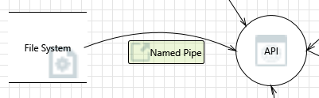

# DESOFS deliverables

## 1. Introduction

O seguinte projeto tem como tema principal um *meal delivery service*, no qual utilizadores do website podem encomendar
de refeições que serão confeccionadas pelos próprios. O propósito deste tema é essêncialmente permitir que,
as pessoas que não têm tempo para comprar ingredientes e pensar numa receita para cozinhar, possam encomendar um pacote,
que trará todos os ingredientes necessários para uma semana de refeições e as respetivas receitas.

## 2. User Stories

### 2.1. Utilizador

**US1** - Eu como utilizador quero poder criar uma conta no website para poder fazer encomendas. Eu não devo criar um
perfil
com
as mesmas credenciais que outra pessoa.

**US2** - Eu como utilizador quero poder fazer login no website para poder fazer encomendas. Eu não devo conseguir fazer
login
com credenciais inválidas ou de outros utilizadores.

**US3** - Eu como utilizador quero poder ver os pacotes dsiponíveis para encomenda, para poder escolher o que mais me
agrada.

**US4** - Eu como utilizador quero poder ver o conjunto de receitas disponíveis para cada pacote, para poder escolher o
que
mais me agrada.

**US5** - Eu como utilizador quero poder fazer o download do conjunto de receitas disponíveis para cada pacote, para
poder
ter acesso às receitas mesmo que não tenha acesso à internet. Eu não devo conseguir fazer download de receitas de
pacotes que não existam.

**US6** - Eu como utilizador quero conseguir efetuar uma encomenda de um pacote, para poder receber os ingredientes e as
receitas em casa. Eu não devo conseguir encomendar pacotes que não existam ou encomendar.

**US7** - Eu como utilizador quero poder ver o estado da minha encomenda, para poder saber quando é que a mesma será
entregue. Eu não devo conseguir ver o estado de encomendas de outros utilizadores.

**US8** - Eu como utilizador quero poder cancelar a minha encomenda, para poder receber o reembolso do valor pago. Eu
não
devo conseguir cancelar encomendas de outros utilizadores.

**US9** - Eu como utilizador quero poder ver o histórico das minhas encomendas, para poder ver o que já encomendei. Eu
não
devo conseguir ver o histórico de encomendas de outros utilizadores.

**US10** - Eu como utilizador quero poder ver reviews sobre os pacotes, para poder saber a opinião de outros
utilizadores
sobre os mesmos. Eu não devo conseguir ver reviews de pacotes que não existam.

**US11** - Eu como utilizador quero poder fazer uma review sobre um pacote, para poder partilhar a minha opinião sobre o
mesmo. Eu não devo conseguir fazer reviews de pacotes que não existam.

**US12** - Eu como utilizador quero poder faer uma alteração a uma review que fiz sobre um pacote, para poder corrigir
algum erro que tenha cometido. Eu não devo conseguir alterar reviews de pacotes que não existam ou editar reviews de
outros utilizadores.

**US13** - Eu como utilizador quero decidir qual o método de pagamento que quero utilizar para pagar a minha encomenda,
para poder escolher o método que me é mais conveniente. Eu não devo conseguir escolher métodos de pagamento que não
existam.

**US14** - Eu como utilizador quero poder adicionar um método de pagamento temporário, para poder pagar a encomenda.
Eu não devo conseguir adicionar métodos de pagamento que já existam.

**US15** - Eu como utilizador quero poder alterar informações do perfil da minha conta, para poder atualizar a minha
informação. Eu
não devo conseguir alterar o perfil de outros utilizadores.

**US16** - Eu como utilizador quero poder alterar a minha password, para poder atualizar a minha password. Eu não devo
conseguir alterar a password de outros utilizadores.

### 2.2. Administrador

**US17** - Eu como administrador quero poder efetuar o login no website, para poder gerir as encomendas. Eu não devo
conseguir fazer login com credenciais inválidas ou de outros utilizadores.

**US18** - Eu como administrador quero poder ver o total de encomendas feitas, para poder saber quantas encomendas foram
feitas. Eu não devo conseguir alterar os números de encomendas feitas.

**US19** - Eu como Administrador quero ter uma dashboard com cada pacoote e o número de encomendas feitas para cada um,
para poder saber quais os pacotes mais populares. Eu não devo conseguir alterar o número de encomendas feitas.

**US20** - Eu como Administrador quero poder criar um novo pacote, para poder adicionar novos pacotes ao website. Eu não
devo conseguir criar pacotes com o mesmo nome que pacotes já existentes.

**US21** - Eu como Administrador quero poder alterar um pacote, para poder atualizar a informação do pacote. Eu não devo
conseguir alterar pacotes que não existam.

**US22** - Eu como Administrador quero poder desativar um pacote, para poder remover pacotes do website. Eu não devo ser
capaz de desativar pacotes que não existam.

**US23** - Eu como Administrador quero poder adicionar receitas a um pacote, para poder adicionar receitas a pacotes.

**US24** - Eu como Administrador quero poder alterar receitas de um pacote, para poder atualizar as receitas de um
pacote.

**US26** - Eu como Administrador quero poder remover reviews com conteúdo impróprio, para poder manter o website limpo.

### 2.4 Gestor de Ficheiros

**US27** - Eu como Gestor de Ficheiros quero poder fazer login no website, para poder gerir as receitas. Eu não devo
conseguir fazer login com credenciais inválidas ou de outros utilizadores.

**US28** - Eu como Gestor de Ficheiros quero poder adicionar uma receita, para poder adicionar receitas a um pacote. Eu
não devo conseguir adicionar receitas que já existam.

**US29** - Eu como Gestor de Ficheiros quero poder alterar uma receita, para poder atualizar a informação da receita. Eu
não devo conseguir alterar receitas que não existam.

**US30** - Eu como Gestor de Ficheiros quero poder remover uma receita, para poder remover receitas de um pacote. Eu não
devo conseguir remover receitas que não existam.

## 2.7 Requisitos de segurança funcionais

Os requisitos de segurança são elementos essenciais para garantir a proteção adequada dos sistemas de informação contra
ameaças cibernéticas. Aqui estão alguns dos requisitos funcionais de segurança que detetamos que devem ser considerados
e implementados:

1. **Autenticação e Autorização**:

    - **RSf1** - Todos os utilizadores devem ser autenticados antes de acederem a qualquer funcionalidade do sistema
      .
    - **RSf2** - Deve haver diferentes níveis de acesso com base nos papéis dos utilizadores.

    - **RSf3** - As credenciais de autenticação devem ser protegidas adequadamente durante a transmissão e
      armazenamento.

2. **Proteção de Dados Pessoais**:
    - **RSf4** - Dados pessoais dos utilizadores, como nomes, endereços de email e informações de contacto, devem ser
      protegidos de acordo com as leis de privacidade de dados locais (por exemplo, GDPR na Europa).
    - **RSf5** -Deve ser implementado um controlo de acesso rigoroso para garantir que apenas utilizadores autorizados
      possam visualizar ou modificar dados pessoais.

3. **Segurança de Sessão**:
    - **RSf6** - Todas as sessões de utilizador devem ser adequadamente geridas e protegidas contra ataques de sessão,
      como sessões roubadas ou sequestro de sessão.
    - **RSf7** - Mecanismos como tokens de sessão, expiração de sessão e autenticação de dois fatores podem ser
      implementados para reforçar a segurança das sessões de utilizador.

4. **Prevenção de Injeção de Dados**:
    - **RSf8** - Todas as entradas do utilizador devem ser validadas e sanitizadas adequadamente para prevenir ataques
      de injeção de dados, como SQL injection e XSS (Cross-Site Scripting).

5. **Segurança de Dados em Repouso e em Trânsito**:
    - **RSf9** - Os dados sensíveis devem ser criptografados adequadamente ao serem armazenados na base de dados e
      durante a transmissão pela rede.
    - **RSf10** - Deve ser implementado SSL/TLS para proteger a comunicação entre o cliente e o servidor.

6. **Monitorização e Registo de Atividades**:
    - **RSf11** - Deve ser implementado um sistema de registo robusto para monitorizar e registar todas as atividades no
      sistema, incluindo tentativas de login, acessos a dados sensíveis e modificações importantes.

7. **Gestão de Vulnerabilidades e Patches**:
    - **RSf12** -Deve haver um processo formal para identificar, avaliar e corrigir vulnerabilidades de segurança no
      sistema, incluindo a aplicação oportuna de patches de segurança.

8. **Segurança do Código**:
    - **RSf13** - O código-fonte do sistema deve ser escrito de acordo com práticas seguras de programação para evitar
      vulnerabilidades comuns, como injeção de SQL, XSS e CSRF (Cross-Site Request Forgery).

9. **Proteção contra Ataques de DDoS**:
    - **RSf4** - Deve ser implementada uma solução de proteção contra ataques de negação de serviço distribuído (DDoS)
      para garantir a disponibilidade contínua do sistema, mesmo durante picos de tráfego malicioso.

10. **Backup e Recuperação de Dados**:
    - **RSf15** - Deve ser implementado um plano de backup regular e seguro para garantir a disponibilidade e
      integridade dos dados em caso de falha do sistema, desastres naturais ou ataques cibernéticos.

### 2.6 Requisitos de Segurança não funcionais

**RSNF1** - O sistema deve ser desenvolvido utilizando Java para o backend e Svelte para o frontend, a fim de garantir
uma arquitetura robusta, escalável e eficiente.

**RSNF2** - O sistema deve ser projetado e otimizado para garantir que o tempo de resposta médio para qualquer interação
do utilizador seja inferior a 3 segundos, a fim de proporcionar uma experiência rápida e responsiva.

**RSNF3** - O sistema deve ser intuitivo e fácil de usar (user-friendly), com uma interface de utilizador bem projetada,
no intuito de abrangir utilizadores de todas as idades

**RSNF4** - O sistema deve implementar mecanismos robustos de autenticação e autorização para garantir que apenas
utilizadores autorizados tenham acesso aos recursos apropriados.

**RSNF5** - O sistema deve manter logs detalhados para todas as atividades dos utilizadores, garantindo a conformidade
com regulamentos e políticas de segurança.

**RSNF6** - O sistema deve ser protegido contra ataques de injeção de SQL, garantindo que todas as consultas SQL sejam
parametrizadas (sanitização dos inputs) e validadas para evitar a execução de comandos maliciosos.

**RSNF7** - O sistema deve seguir uma abordagem positivista de controlo de acesso, onde os utilizadores só têm acesso a
recursos específicos através de permissões explícitas concedidas pelos administradores, de forma a prevenir acessos
indesejados.

**RSNF8** - A aplicação não deve utilizar tecnologias client-side não suportadas, inseguras ou obsoletas, como plugins
NSAPI, Flash, Shockwave, ActiveX, Silverlight, NACL ou applets Java do lado do cliente.

### 2.5 Requisitos de Segurança de desenvolvimento

**RSD1** - Uso de uma checklist de boas práticas de código

**RSD2** - Efetuar revisões de código

**RSD3** - Implementar um design seguro

**RSD4** - Implementar a arquitetura Onion para a API

**RSD5** - Fazer pseudo requests com o uso da api do sveltekit

**RSD6** - Usar o dependabot

**RSD7** - Usar o github actions para CI/CD

**RSD8** - Usar o DockerScout

**RSD9** - Usar o OWASP ASVS checklist

**RSD10** - Seguir uma semantica fixa para o controlo de versões

**RSD11** - Seguir normas para efetuar commits

**RSD12** - Usar Trunk Based Development

**RSD13** - Apenas efetuar o Release please após a revisão de código por parte de todos os membros da equipa

**RSD14** - Usar ferramentas de threat modeling como a Microsoft Threat Modeling Tool e o OWASP Threat Dragon

**RSD15** - Usar ferramentas de segurança como o OWASP ZAP

# Use And Abuse cases

## User Authentication

## User Order

## File manager

## Administrator

# Aquitetura

## Domain model

## Diagrama de entidade relação 

## Diagramas de implantanção

### Diagrama de implantação de nível 1

### Diagrama de implantação de nível 2

## Diagrama de componentes

### Diagrama de componentes de nível 2

### Diagrama de componentes de nível 3

## Diagrama de pacotes

# Pipeline Design

# Threat Analysis

## STRIDE

| Categoria              | Descrição                                                                                                                                                                                                                                                                                        |
|------------------------|--------------------------------------------------------------------------------------------------------------------------------------------------------------------------------------------------------------------------------------------------------------------------------------------------|
| Spoofing               | **Threat 1**: A aplicação tem de ser accessivel aos utilizadores, consequentemente tem de ser fácil de user, contudo não se pode introduzir uma ameaça  **Threat 2**: Visto esta aplicação ser delivery service, implica que haja a possibilidade de alguem se fazer passar por outra pessoa |
| Tampering              | **Threat 1**: Como existem receitas para fazer download, que se encontram no servidor, é possivel que estas sejam editadas                                                                                                                                                                       |
| Repudiation            | Sem Ameaças                                                                                                                                                                                                                                                                                      |
| Information disclosure | **Threat 1**: É possivel que haja XSS visto haver formas de inserir scripts de javascript, com isto é possivel adquirir informação de outros utilizadores    **Threat 2**: É possivel interceptar pedidos de Http, consequentemente obter informação que não era suposto                     |
| Denial of service      | **Threat 1**: Visto ser um sistema monólitico, é possivel efetuar um DoS                                                                                                                                                                                                                         |
| Elevation of privilege | Sem Ameaças                                                                                                                                                                                                                                                                                      |

## ASF

| Category                 | Description                                                                                                                                             |
|--------------------------|---------------------------------------------------------------------------------------------------------------------------------------------------------|
| Auditing and Logging     | **Threat 1**: Como não existe sistema de logging, não é possivel saber quem fez o que e quando.  **Threat 2**: Qualquer pessoa pode aceder aos logs |
| Authentication           | **Threat 1**: Com o sistema simples que está em uso, é relativamente fácil de usar credenciais de outros utilizadores                                   |
| Authorization            | **Threat 1**: Qualquer pessoa pode fazer download das receitas, criando um possivel ponto de entrada                                                    |
| Configuration management | **Threat 1**: A aplicação está a correr com todas as permições, logo é uma possível ameaça                                                              |

## Entry Points

Os Entry points são os diferentes locais de acesso e interação dos utilizadores com o sistema da Cozinha na Cozinha.
Cada ponto de entrada oferece uma funcionalidade específica e define o nível de acesso necessário. Eles são essenciais
para a navegação e utilização adequada da plataforma, proporcionando uma experiência intuitiva e segura para os
utilizadores.

Abaixo está uma lista dos principais pontos de entrada do sistema, juntamente com uma breve descrição de suas
funcionalidades e os níveis de confiança associados:

| ID | Name                              | Description                                                                                                                          | Trust Level                                                                                                                                |
|----|-----------------------------------|--------------------------------------------------------------------------------------------------------------------------------------|--------------------------------------------------------------------------------------------------------------------------------------------|
| 1  | HTTPS Port                        | O site da CozinhaNaCozinha é acessível apenas através do uso de TLS. Todas as páginas do site estão protegidas por esta camada.      | (1) Anonymous Web User (2) Utilizador com credenciais de login válidas (3) Utilizador com credenciais de login inválidas (4) Administrador |
| 2  | Página de Login                   | Membros e administradores devem fazer login para aceder a funcionalidades de aquisição de serviço ou gestão dos serviços adquiridos. | (1) Anonymous Web User (2) Utilizador com credenciais de login válidas (3) Utilizador com credenciais de login inválidas (4) Administrador |
| 3  | Página Inicial                    | Todos os visitantes podem aceder à página principal para visualizar planos, serviços, informações e tirar dúvidas.                   | (1) Anonymous Web User (2) Utilizador com credenciais de login válidas (3) Utilizador com credenciais de login inválidas (4) Administrador |
| 4  | Página de Planos de Refeições     | Apresenta diferentes planos de refeições disponíveis para compra. Os utilizadores podem visualizar opções e selecionar as desejadas. | (1) Anonymous Web User (2) Utilizador com credenciais de login válidas (3) Utilizador com credenciais de login inválidas (4) Administrador |
| 5  | Página de Receitas                | Oferece uma coleção de receitas para inspirar utilizadores na preparação de refeições.                                               | (1) Anonymous Web User (2) Utilizador com credenciais de login válidas (3) Utilizador com credenciais de login inválidas (4) Administrador |
| 6  | Página de Subscrição              | Permite aos utilizadores gerir as suas subscrições, atualizando informações de pagamento e preferências de entrega.                  | (2) Utilizador com credenciais de login válidas (4) Administrador                                                                          |
| 7  | Página de Contacto                | Oferece informações de contacto para os utilizadores entrarem em contacto com o suporte ao cliente.                                  | (1) Anonymous Web User (2) Utilizador com credenciais de login válidas (4) Administrador                                                   |
| 8  | Página Sobre Nós                  | Fornece informações sobre a empresa, sua missão, valores e equipa.                                                                   | (1) Anonymous Web User (2) Utilizador com credenciais de login válidas (4) Administrador                                                   |
| 9  | Página de FAQ                     | Responde a perguntas frequentes sobre o serviço, procedimentos de entrega, políticas de cancelamento, etc.                           | (1) Anonymous Web User (2) Utilizador com credenciais de login válidas (4) Administrador                                                   |
| 10 | Painel de Administração           | Interface exclusiva para administradores gerirem utilizadores, conteúdo do site e relatórios de vendas.                              | (4) Administrador                                                                                                                          |
| 11 | Página de Perfil do Utilizador    | Permite aos utilizadores visualizar e editar as suas informações pessoais, histórico de pedidos e preferências de refeições.         | (2) Utilizador com credenciais de login válidas                                                                                            |
| 12 | Página do Carrinho                | Mostra os itens selecionados pelos utilizadores para compra antes do checkout.                                                       | (2) Utilizador com credenciais de login válidas                                                                                            |
| 13 | Página de Checkout                | Permite aos utilizadores rever e confirmar as suas compras antes do pagamento.                                                       | (2) Utilizador com credenciais de login válidas                                                                                            |
| 14 | Página de Histórico de Encomendas | Exibe o histórico de encomendas dos utilizadores, incluindo detalhes da compra e estado de entrega.                                  | (2) Utilizador com credenciais de login válidas                                                                                            |
| 15 | Página de upload às receitas      | Permite ao administrador dar upload às receitas e aos packs                                                                          | (4) Administrador                                                                                                                          |
| 16 | Página de download das receitas   | Permite aos utilizadores registrados fazerem download das receitas do pack da semana                                                 | (2) Utilizador com credenciais de login válidas                                                                                            |

## Exit Points

| ID | Name                                 |
|----|--------------------------------------|
| 1  | HTTP Response                        |
| 2  | Pedidos à API                        |
| 3  | Falha na validação dos dados         |
| 4  | Operação de escrita na base de dados |
| 5  | Finalização de uma transação         |
| 6  | Tratar de Erros                      |
| 7  | Logging                              |
| 8  | Término da Sessão                    |
| 9  | Interação dos utilizadores           |

## QUALITATIVE RISK MODEL

Como forma de criar o "Qualitative Risk Model", determinou-se que a escala atribuída
para o "Likelihood" e o "Impact" varia entre 1 e 5, sendo que 1 seria o menor valor (menor impacto/probabilidade) e 5
seria o maior valor.

Para calcular o valor do risco, utilizou-se a fórmula: Risk = Likelihood * Impact ,definida em
https://owasp.org/www-community/OWASP_Risk_Rating_Methodology .

Desta forma, considerou-se os seguintes riscos:

**R1** - Denial of Service

**R2** - Information Disclosure

**R3** - Spoofing

**R4** - Tampering

**R5** - Repudiation

**R6** - Elevation of Privilege

**R7** - Social Engineering

| Risk | Likelihood | Impact | Risk Value |
|------|------------|--------|------------|
| R1   | 4          | 5      | 20         |
| R2   | 4          | 5      | 20         |
| R3   | 3          | 3      | 9          |
| R4   | 2          | 2      | 4          |
| R5   | 1          | 2      | 2          |
| R6   | 2          | 5      | 10         |
| R7   | 2          | 4      | 8          |

Analisando a seguinte tabela, os riscos RS1 e RS2 apresentam um maior valor,
sendo necessário prioritizar a mitigação dos mesmos, já os riscos RS4 e RS5, apresentam
um valor inferior, podendo exigir uma atenção menos imediata.

## Countermeasures

### STRIDE

| Categoria              | Descrição                                                                                                                                                                                                                                                                                                                                                                                      |
|------------------------|------------------------------------------------------------------------------------------------------------------------------------------------------------------------------------------------------------------------------------------------------------------------------------------------------------------------------------------------------------------------------------------------|
| Spoofing               | **Countermeasure 1**: Utilização de autenticação de dois fatores  **Countermeasure 2**: É obrigatório ter passwords fortes   **Countermeasure 3**: É utilizado Jwt em vez de uma autênticação baseada na base de dados                                                                                                                                                                 |
| Tampering              | **Countermeasure 1**: Utilização de Hashing para as receitas  **Countermeasure 2**: Utilização de HTTPS para as comunicações entre o cliente e o servidor   **Countermeasure 3**: Criar diferentes definições de acessos                                                                                                                                                               |
| Repudiation            | **Countermeasure 1**: Todas as compras são guardadas na base de dados em formato de event streaming                                                                                                                                                                                                                                                                                            |
| Information disclosure | **Countermeasure 1**: Utilização de HTTPS para as comunicações entre o cliente e o servidor  **Countermeasure 2**: Utilização de JWT para autenticação  **Countermeasure 3**: Utilização de CORS para proteger a API   **Countermeasure 3**: Aplicar algoritmos de validação a inputs                                                                                              |
| Denial of service      | **Countermeasure 1**: Utilização de um sistema distribuido em vez de um sistema monolitico  **Countermeasure 2**: Utilização de um sistema de rate limiting                                                                                                                                                                                                                                |
| Elevation of privilege | **Countermeasure 1**: Utilização de HTTPS para as comunicações entre o cliente e o servidor  **Countermeasure 2**: Utilização de JWT para autenticação  **Countermeasure 3**: Utilização de CORS para proteger a API   **Countermeasure 3**: Aplicar algoritmos de validação a inputs   **Countermeasure 4**: Ninguem deve ter a capacidade de mudar os privilégios do sistema |

## Dataflow Diagram Lv1

O diagrama de fluxo de dados é uma representação visual que ilustra o percurso e processamento dos dados dentro do
sistema da CozinhaNaCozinha. Ele descreve como os dados são obtidos, manipulados e transformados ao longo de diferentes
processos e entidades do sistema. Este diagrama oferece uma visão abrangente do fluxo de informações, desde sua entrada
no sistema até sua saída, ajudando a entender o comportamento e a interação dos componentes do sistema.

Ao analisar o diagrama de fluxo de dados, é possível identificar os diferentes elementos do sistema, como entidades
externas, processos internos e armazenamento de dados. Cada seta representa o movimento de dados entre esses elementos,
mostrando a direção e o tipo de informação sendo transmitida. Além disso, os processos de transformação de dados são
representados por retângulos, enquanto os dados armazenados são mostrados em bases de dados ou repositórios.

O diagrama abaixo ilustra o diagrama de nível 1, que, por sua natureza mais abrangente, não apresenta detalhes
específicos. Como podemos observar no diagrama, os utilizadores interagem com a aplicação web, ou frontend, onde também
podem receber inputs de cookies, caso já existam. O percurso prossegue com a comunicação bidirecional com a API do
backend, o que significa que ambos os lados recebem e enviam informações um para o outro. No backend, dependendo da
operação, as informações podem ser recebidas da base de dados relacional ou do sistema de ficheiros, e todas essas
operações são registradas nos logs. É importante destacar que as comunicações entre o utilizador, a aplicação web e a
API do backend ocorrem via HTTPS, garantindo segurança na transmissão de dados.

## DREAD

O modelo DREAD é uma estrutura de avaliação de riscos comumente usada para identificar e priorizar vulnerabilidades em
sistemas de software. Cada letra no acrônimo DREAD representa um critério específico usado para avaliar o impacto das
vulnerabilidades. Vamos analisar brevemente cada um desses critérios:

D - Damage Potential (Potencial de Dano)
Este critério avalia o potencial de danos que uma vulnerabilidade pode causar se explorada por um atacante. Uma
pontuação alta indica que a vulnerabilidade pode resultar em danos significativos ao sistema ou aos dados.

R - Reproducibility (Reprodutibilidade)
A Reprodutibilidade considera a probabilidade de que a vulnerabilidade possa ser reproduzida em diferentes
circunstâncias. Uma pontuação alta sugere que a vulnerabilidade pode ser facilmente reproduzida e explorada
repetidamente.

E - Exploitability (Explorabilidade)
A Explorabilidade avalia o quão fácil é para um atacante explorar a vulnerabilidade. Uma pontuação alta indica que a
vulnerabilidade pode ser facilmente explorada, possivelmente através de métodos automatizados.

A - Affected Users (Utilizadores Afetados)
Este critério analisa o número e a importância dos utilizadores que podem ser afetados pela vulnerabilidade. Uma
pontuação alta indica que um grande número de utilizadores pode ser afetado, especialmente aqueles com informações
sensíveis ou privilegiadas.

D - Discoverability (Descoberta)
A Descoberta considera o quão fácil é para um atacante descobrir a vulnerabilidade. Uma pontuação alta sugere que a
vulnerabilidade pode ser facilmente descoberta, possivelmente através de métodos de teste de segurança automatizados.

Abaixo é possivel observar algumas das ameaças detetadas ao usar o software Microsft Thread Model Tool.

1. **Weak Authentication Scheme**
    - **D (Damage Potencial)**: Alto (a fraqueza na autenticação pode levar à divulgação não autorizada de informações
      confidenciais dos utilizadores).
    - **R (Reproducibility)**: A reprodução deste problema é provável, especialmente se as fraquezas na autenticação são
      comuns e podem ser exploradas repetidamente.
    - **E (Exploitability)**: A explorabilidade é alta, especialmente se as vulnerabilidades de autenticação são
      geralmente alvo de ataques automatizados e podem ser exploradas facilmente.
    - **A (Affected users)**: Todos os utilizadores do sistema podem ser afetados, especialmente aqueles cujas
      credenciais estão em risco.
    - **D (Discoverability)**: A descoberta deste problema é relativamente fácil, especialmente porque as fraquezas na
      autenticação são conhecidas e podem ser identificadas através de testes de segurança.

2. **Web Application Process Memory Tampered**
    - **D (Damage Potencial)**: Alto (a manipulação da memória do processo da aplicação web pode levar a
      vulnerabilidades de execução remota de código).
    - **R (Reproducibility)**: A reprodução deste problema é provável, especialmente se a aplicação web tiver acesso
      direto à memória ou aos ponteiros.
    - **E (Exploitability)**: A explorabilidade é alta, especialmente se a aplicação web permitir a execução de funções
      arbitrarias ou manipulação de ponteiros.
    - **A (Affected users)**: Todos os utilizadores da aplicação web podem ser afetados, pois a manipulação da memória
      pode comprometer a segurança do sistema.
    - **D (Discoverability)**: A descoberta deste problema pode ser mais difícil, mas ainda é possível identificar
      através de testes de segurança e análise de código.

3. **Elevation Using Impersonation**
    - **D (Damage Potencial)**: Alto (a elevação de privilégios pode permitir que um atacante execute ações maliciosas
      em nome do aplicativo web).
    - **R (Reproducibility)**: A reprodução deste problema é provável, especialmente se o API permitir a falsificação de
      contexto.
    - **E (Exploitability)**: A explorabilidade é alta, especialmente se o API permitir a falsificação de contexto.
    - **A (Affected users)**: Todos os utilizadores do sistema podem ser afetados, especialmente se as ações realizadas
      com privilégios elevados comprometerem a segurança do sistema.
    - **D (Discoverability)**: A descoberta deste problema pode ser difícil, mas ainda é possível identificar através de
      testes de segurança e monitoramento de atividades suspeitas.

4. **JavaScript Object Notation Processing**
    - **D (Damage Potencial)**: Alto (a manipulação do JSON pode levar à execução de scripts maliciosos ou à divulgação
      não autorizada de informações sensíveis).
    - **R (Reproducibility)**: A reprodução deste problema é provável, especialmente se a aplicação web processar JSON
      de forma insegura.
    - **E (Exploitability)**: A explorabilidade é alta, especialmente se a aplicação web permitir a execução de scripts
      maliciosos ou se os dados JSON não forem devidamente validados.
    - **A (Affected users)**: Todos os utilizadores da aplicação web que interagem com dados JSON podem ser afetados.
    - **D (Discoverability)**: A descoberta deste problema pode ser relativamente fácil, especialmente através de testes
      de segurança automatizados.

5. **Elevation by Changing the Execution Flow in Web Service**
    - **D (Damage Potencial)**: Alto (a alteração do fluxo de execução pode permitir que um atacante execute ações
      maliciosas ou comprometa a integridade do sistema).
    - **R (Reproducibility)**: A reprodução deste problema é provável, especialmente se o API permitir a alteração do
      fluxo de execução através de dados não validados.
    - **E (Exploitability)**: A explorabilidade é alta, especialmente se o API permitir a alteração do fluxo de execução
      através de dados não validados.
    - **A (Affected users)**: Todos os utilizadores do sistema podem ser afetados, especialmente se as ações realizadas
      com o fluxo de execução alterado comprometerem a segurança do sistema.
    - **D (Discoverability)**: A descoberta deste problema pode ser mais difícil, mas ainda é possível identificar
      através de testes de segurança e monitoramento de atividades suspeitas.

1. **Spoofing of Source Data Store Cookies**
    - **D (Damage Potencial)**: Alto (cookies podem ser falsificados por um atacante e isso pode levar à entrega de
      dados incorretos para a Aplicação Web).
    - **R (Reproducibility)**: A reprodução deste problema é provável, especialmente se cookies não forem devidamente
      protegidos.
    - **E (Exploitability)**: A explorabilidade é alta, pois a falsificação de cookies é uma técnica bem conhecida e
      pode ser facilmente explorada.
    - **A (Affected users)**: Todos os utilizadores que interagem com a aplicação web podem ser afetados, especialmente
      se dados incorretos forem entregues devido à falsificação de cookies.
    - **D (Discoverability)**: A descoberta deste problema é relativamente fácil, especialmente se os cookies não forem
      adequadamente protegidos contra falsificação.

2. **Cross Site Scripting**
    - **D (Damage Potencial)**: Alto (o servidor web 'Aplicação Web' pode ser alvo de um ataque de cross-site scripting
      porque não sanitiza entrada não confiável).
    - **R (Reproducibility)**: A reprodução deste problema é provável, especialmente se a entrada não confiável não for
      adequadamente tratada.
    - **E (Exploitability)**: A explorabilidade é alta, pois o cross-site scripting é uma vulnerabilidade comum e pode
      ser facilmente explorada.
    - **A (Affected users)**: Todos os utilizadores que interagem com a aplicação web podem ser afetados, especialmente
      se forem vítimas de ataques de cross-site scripting.
    - **D (Discoverability)**: A descoberta deste problema é relativamente fácil, especialmente se a aplicação web não
      tiver proteções adequadas contra cross-site scripting.

3. **Persistent Cross Site Scripting**
    - **D (Damage Potencial)**: Alto (o servidor web 'Aplicação Web' pode ser alvo de um ataque de cross-site scripting
      persistente porque não sanitiza corretamente as entradas e saídas de cookies).
    - **R (Reproducibility)**: A reprodução deste problema é provável, especialmente se a entrada e saída de cookies não
      forem adequadamente tratadas.
    - **E (Exploitability)**: A explorabilidade é alta, pois o cross-site scripting persistente pode ser explorado
      repetidamente.
    - **A (Affected users)**: Todos os utilizadores que interagem com a aplicação web podem ser afetados, especialmente
      se forem vítimas de ataques de cross-site scripting persistente.
    - **D (Discoverability)**: A descoberta deste problema é relativamente fácil, especialmente se a aplicação web não
      tiver proteções adequadas contra cross-site scripting persistente.

4. **Weak Access Control for a Resource**
    - **D (Damage Potencial)**: Alto (a proteção inadequada de cookies pode permitir que um atacante leia informações
      não destinadas à divulgação).
    - **R (Reproducibility)**: A reprodução deste problema é provável, especialmente se a proteção de cookies não for
      adequadamente implementada.
    - **E (Exploitability)**: A explorabilidade é alta, pois a leitura de informações não autorizadas é uma técnica
      comum de ataque.
    - **A (Affected users)**: Todos os utilizadores que interagem com a aplicação web podem ser afetados, especialmente
      se informações sensíveis forem acessadas indevidamente.
    - **D (Discoverability)**: A descoberta deste problema é relativamente fácil, especialmente se a aplicação web não
      tiver controles de acesso adequados.

5. **Authenticated Data Flow Compromised**
    - **D (Damage Potencial)**: Alto (um atacante pode ler ou modificar dados transmitidos sobre um fluxo de dados
      autenticado).
    - **R (Reproducibility)**: A reprodução deste problema é provável, especialmente se o fluxo de dados autenticado não
      for adequadamente protegido.
    - **E (Exploitability)**: A explorabilidade é alta, pois a leitura ou modificação de dados em um fluxo de dados
      autenticado é uma vulnerabilidade séria.
    - **A (Affected users)**: Todos os utilizadores que dependem do fluxo de dados autenticado podem ser afetados,
      especialmente se as informações forem comprometidas.
    - **D (Discoverability)**: A descoberta deste problema pode ser difícil, pois pode exigir análise detalhada do
      sistema e monitoramento de atividades suspeitas.

1. **Spoofing of Source Data Store SQL Database**
    - **D (Damage Potencial)**: Alto (a base de dados SQL pode ser falsificado por um atacante e isso pode levar à
      entrega de dados incorretos para a API).
    - **R (Reproducibility)**: A reprodução deste problema é provável, especialmente se a base de dados SQL não for
      adequadamente protegido contra spoofing.
    - **E (Exploitability)**: A explorabilidade é alta, pois o spoofing da base de dados SQL é uma técnica bem conhecida
      e pode ser facilmente explorada.
    - **A (Affected users)**: Todos os utilizadores que interagem com a API podem ser afetados, especialmente se dados
      incorretos forem entregues devido ao spoofing da base de dados SQL.
    - **D (Discoverability)**: A descoberta deste problema é relativamente fácil, especialmente se a base de dados SQL
      não for adequadamente protegido contra spoofing.

2. **Weak Access Control for a Resource**
    - **D (Damage Potencial)**: Alto (a proteção inadequada da base de dados SQL pode permitir que um atacante leia
      informações não destinadas à divulgação).
    - **R (Reproducibility)**: A reprodução deste problema é provável, especialmente se a proteção da base de dados SQL
      não for adequadamente implementada.
    - **E (Exploitability)**: A explorabilidade é alta, pois a leitura de informações não autorizadas é uma técnica
      comum de ataque.
    - **A (Affected users)**: Todos os utilizadores que interagem com a API podem ser afetados, especialmente se
      informações sensíveis forem acessadas indevidamente.
    - **D (Discoverability)**: A descoberta deste problema é relativamente fácil, especialmente se a API não tiver
      controles de acesso adequados.

1. **Spoofing of Source Data Store File System**
    - **D (Damage Potencial)**: Alto (o sistema de ficheiros pode ser falsificado por um atacante e isso pode levar à
      entrega de dados incorretos para a API).
    - **R (Reproducibility)**: A reprodução deste problema é provável, especialmente se o sistema de ficheiros não for
      adequadamente protegido contra spoofing.
    - **E (Exploitability)**: A explorabilidade é alta, pois o spoofing do sistema de ficheiros é uma técnica bem
      conhecida e pode ser facilmente explorada.
    - **A (Affected users)**: Todos os utilizadores que interagem com a API podem ser afetados, especialmente se dados
      incorretos forem entregues devido ao spoofing do sistema de ficheiros.
    - **D (Discoverability)**: A descoberta deste problema é relativamente fácil, especialmente se o sistema de
      ficheiros não for adequadamente protegido contra spoofing.

2. **Weak Access Control for a Resource**
    - **D (Damage Potencial)**: Alto (a proteção inadequada do sistema de ficheiros pode permitir que um atacante leia
      informações não destinadas à divulgação).
    - **R (Reproducibility)**: A reprodução deste problema é provável, especialmente se a proteção do sistema de
      ficheiros não for adequadamente implementada.
    - **E (Exploitability)**: A explorabilidade é alta, pois a leitura de informações não autorizadas é uma técnica
      comum de ataque.
    - **A (Affected users)**: Todos os utilizadores que interagem com a API podem ser afetados, especialmente se
      informações sensíveis forem acessadas indevidamente.
    - **D (Discoverability)**: A descoberta deste problema é relativamente fácil, especialmente se a API não tiver
      controles de acesso adequados.

3. **Authenticated Data Flow Compromised**
    - **D (Damage Potencial)**: Alto (um atacante pode ler ou modificar dados transmitidos sobre um fluxo de dados
      autenticado).
    - **R (Reproducibility)**: A reprodução deste problema é provável, especialmente se o fluxo de dados autenticado não
      for adequadamente protegido.
    - **E (Exploitability)**: A explorabilidade é alta, pois a leitura ou modificação de dados em um fluxo de dados
      autenticado é uma vulnerabilidade séria.
    - **A (Affected users)**: Todos os utilizadores que dependem do fluxo de dados autenticado podem ser afetados,
      especialmente se as informações forem comprometidas.
    - **D (Discoverability)**: A descoberta deste problema pode ser difícil, pois pode exigir análise detalhada do
      sistema e monitoramento de atividades suspeitas.

## Attack Tree

A attack tree é uma representação de possíveis vias de ataque que um utilizador malicioso pode usar para comprometer um
sistema. Cada nó na árvore representa um ponto de decisão para o atacante, e os ramos indicam diferentes caminhos que
podem ser seguidos para alcançar um objetivo malicioso. Vamos explorar brevemente alguns dos ataques representados nesta
árvore:

### Ataque 1: Fraca Autenticação

- **Sub-ataque 1.1**: Brute Force Attack
- **Sub-ataque 1.2**: Password Guessing
- **Sub-ataque 1.3**: Roubo de Credenciais

### Ataque 2: Vulnerabilidades na Validação do Input

- **Sub-ataque 2.1**: Injeção de SQL
- **Sub-ataque 2.2**: Cross site scripting (XSS)
- **Sub-ataque 2.3**: Injeção de Comandos

### Ataque 3: Exploração de Configurações Incorretas do Servidor

- **Sub-ataque 3.1**: Credenciais Padrão
- **Sub-ataque 3.2**: Exposição de Informações Sensíveis
- **Sub-ataque 3.3**: Falta de Permissões dos Ficheiros

### Ataque 4: Vulnerabilidades nos Componentes de Terceiros

- **Sub-ataque 4.1**: Exploração de vulnerabilidades em bibliotecas de terceiros
- **Sub-ataque 4.2**: Utilização de software desatualizado
- **Sub-ataque 4.3**: Falta de Permissões dos Ficheiros

### Ataque 5: Intercetação de Dados

- **Sub-ataque 5.1**: Interceção de Comunicações não Seguras (HTTP)
- **Sub-ataque 5.2**: Interceção de Comunicações Criptografadas (SSL/TLS)

### Ataque 6: Denial of Service (DoS/DDoS)

- **Sub-ataque 6.1**: Sobrecarga de Recursos
- **Sub-ataque 6.2**: Ataques de Amplificação
- **Sub-ataque 6.3**: Ataques de Bandwitch Exhaustion

### Ataque 7: Ataques de Sessão

- **Sub-ataque 7.1**: Captura de Sessão
- **Sub-ataque 7.2**: Fixação de Sessão
- **Sub-ataque 7.3**: Sequestro de Sessão
- **Sub-ataque 7.4**: Redirecionamento Aberto

### Ataque 8: Vulnerabilidades no Upload de ficheiros

- **Sub-ataque 8.1**: Execução de ficheiros Maliciosos
- **Sub-ataque 8.2**: Upload de ficheiros com Nomes Manipulados
- **Sub-ataque 8.3**: Bypass de Restrições de Tipo de Arquivo

### Ataque 9: Vulnerabilidades no Download de ficheiros

- **Sub-ataque 9.1**: Download de ficheiros Sensíveis
- **Sub-ataque 9.2**: Inclusão de ficheiros Executáveis
- **Sub-ataque 9.3**: Download de ficheiros com Nomes Manipulados

### Ataque 10: Fraudes em Pagamentos Bancários

- **Sub-ataque 10.1**: Phishing de Dados de Cartão de Crédito
- **Sub-ataque 10.2**: Man-in-the-Middle (MitM) em Transações
- **Sub-ataque 10.3**: Roubo de Credenciais de Conta Bancária

# Ferramentas de teste

https://owasp.org/www-community/api_security_tools

https://owasp.org/www-community/Free_for_Open_Source_Application_Security_Tools

## 1. SAST

De forma a analisar o código fonte da aplicação, é necessário utilizar ferramentas de Static Application Security
Testing (SAST). Estas ferramentas permitem identificar vulnerabilidades de segurança no código fonte, como falhas de
autenticação, injeção de SQL, cross-site scripting (XSS) e outras vulnerabilidades comuns.
Optou-se por utilizar o SonarQube para realizar esta tarefa, pois é uma ferramenta open-source que suporta várias
linguagens de programação e oferece uma análise abrangente do código fonte, identificando bugs, vulnerabilidades e "code
smells" (https://www.sonarsource.com/products/sonarqube/).

## DAST (Dynamic testing)

Os testes dinâmicos de segurança das aplicações (DAST) representam uma metodologia fundamental para a avaliação da
segurança das aplicações Web em funcionamento. Ao contrário de outras metodologias, como os testes estáticos de
segurança das aplicações (SAST), que analisam o código fonte, ou os testes de penetração manual, os DAST examinam a
aplicação em tempo real, simulando ataques reais.

A DAST funciona interagindo com a aplicação web de forma análoga à de um atacante malévolo. Transmite pedidos HTTP à
aplicação, explorando vários componentes, incluindo entradas de formulários, parâmetros de URL e cabeçalhos de pedidos.
Em seguida, analisa as respostas da aplicação em busca de indicações de vulnerabilidades de segurança, como injecções de
SQL, XSS (Cross-Site Scripting), CSRF (Cross-Site Request Forgery), entre outras.

A DAST desempenha um papel fundamental na identificação e retificação de vulnerabilidades de segurança em aplicações
Web. Ao simular ataques genuínos, permite que as organizações compreendam a sua suscetibilidade a ameaças e implementem
medidas preventivas para reforçar a sua postura de segurança. Além disso, a DAST fornece relatórios completos sobre as
vulnerabilidades identificadas, facilitando assim a definição de prioridades e a retificação dessas deficiências.

### Aplicações com metodologia DAST

Algumas das principais ferramentas de teste dinâmico de segurança de aplicações (DAST) incluem Burp Suite, OWASP ZAP,
Acunetix e AppScan. Estas ferramentas oferecem recursos automatizados de verificação de vulnerabilidades para aplicações
Web e relatórios detalhados sobre as vulnerabilidades encontradas.

### 3. IAST

https://www.contrastsecurity.com/contrast-community-edition
